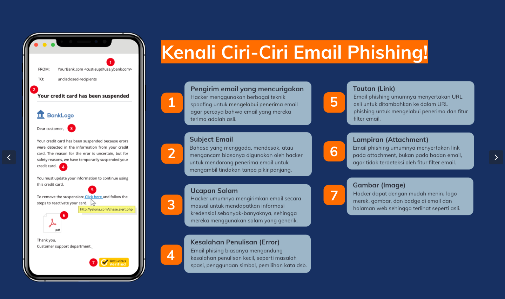
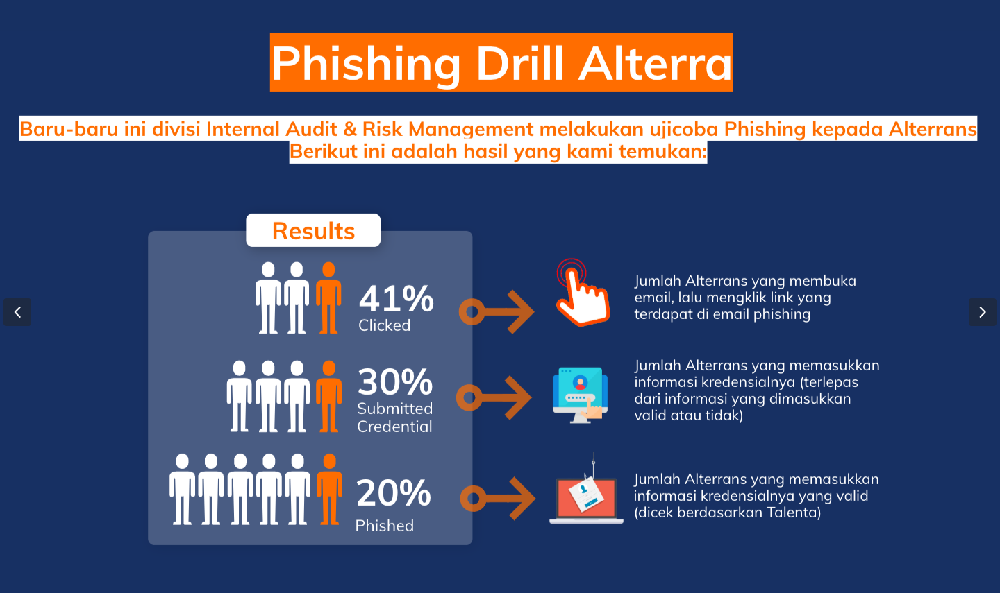
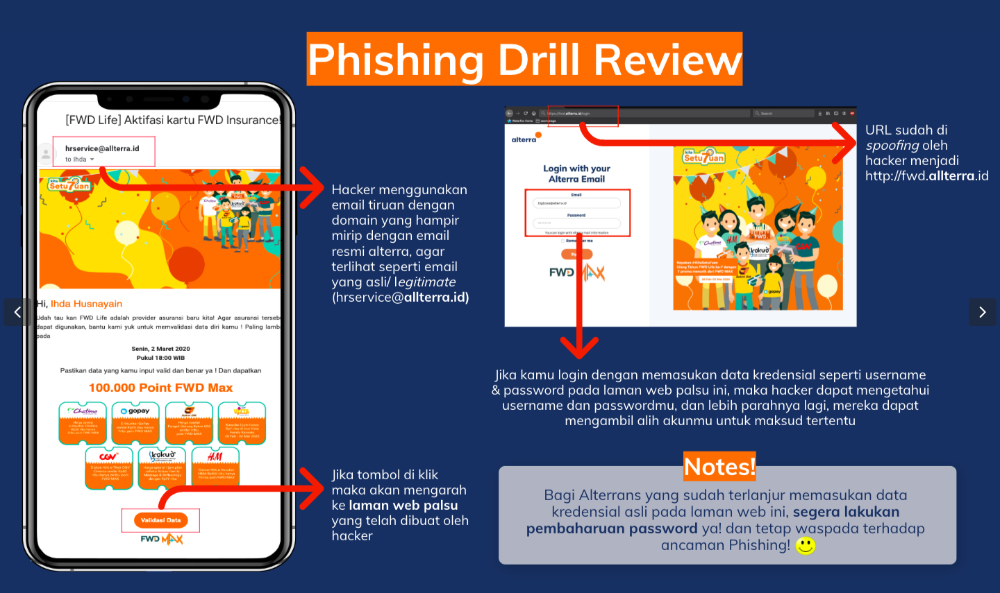
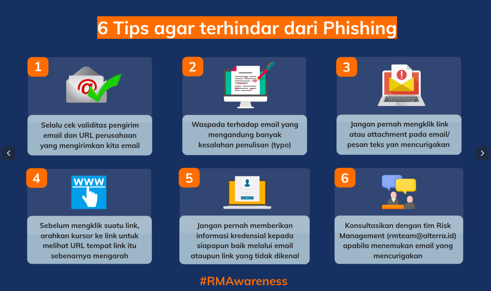

= Danger of Phishing!

Taukah kamu? Akhir-akhir ini seringkali terjadi kejahatan online yang banyak menjadi ancaman bagi masyarakat. Beberapa di antaranya adalah _phising_. 

Apa itu _phising_? _Phising_ merupakan upaya untuk mendapatkan informasi data seseorang dengan teknik pengelabuan. Data yang menjadi sasaran _phising_ dapat berupa data pribadi (nama, usia, alamat), data akun (username dan password), hingga data finansial (informasi kartu kredit, rekening). Pelaku kejahatan ini biasanya menampakkan diri sebagai pihak atau institusi yang berwenang,yang kemudian mengirimkan email yang terlihat meyakinkan kepada korban yang telah ditentukan.

Nah, bagaimana caranya kita mengenali email _phising_? Yuk, simak beberapa ciri-cirinya pada gambar berikut.

Terkait _phising_, Divisi Internal Audit and Risk Management (IARM) pernah mencoba untuk _phising drill_ di Alterra dengan melakukan uji coba _phising_ ke Alterrans. Ternyata, masih ada sejumlah Alterrans yang terjebak dan memberikan _credential_ yang valid. 

Bagaimana uji coba _phising_ ini dilakukan? Berikut adalah detail prosesnya. 

Bagaimana pendapatmu setelah membaca hasil _phising drill_ di atas? Sangat berbahaya bukan? Kamu bisa mengantisipasinya dengan berhati-hati setiap menerima email. Yuk, simak tips berikut !

