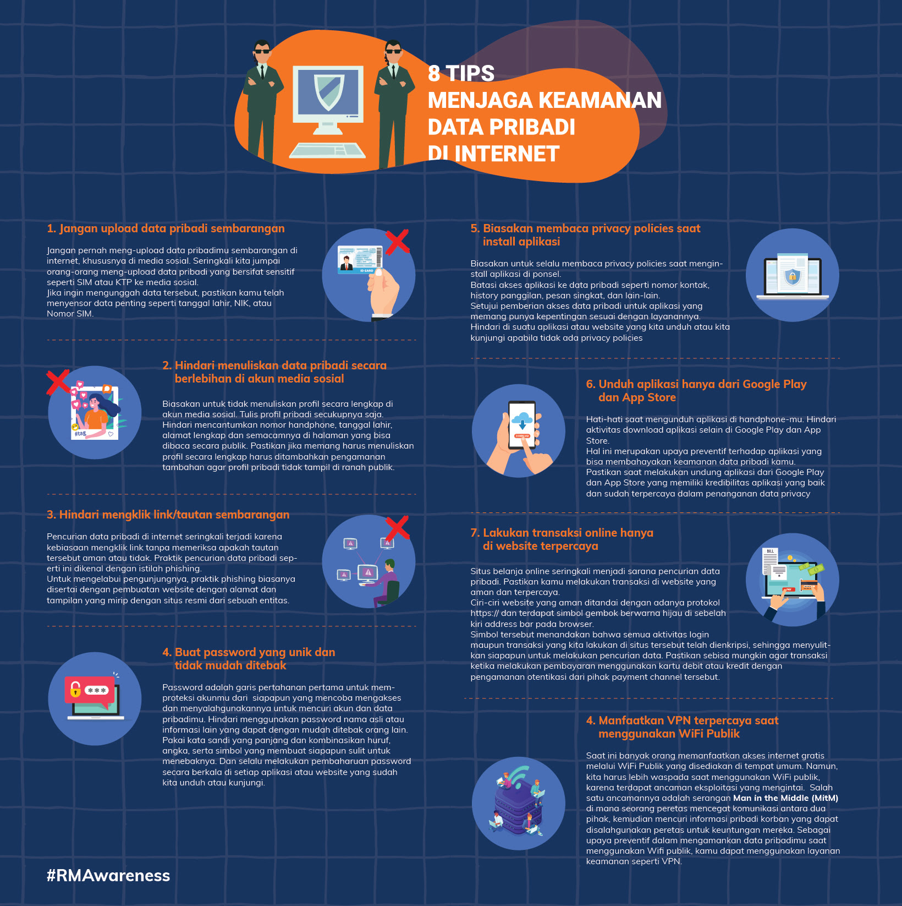

= Data Pribadi Rentan Bocor di Internet? Ini Tips Amannya

Di tengah era digital seperti saat ini, berbagai data dan informasi dapat dengan mudah kita akses kapanpun dan di manapun, asalkan ada koneksi internet. Sayangnya, hal ini juga membuat kita lengah atau tidak aware terhadap terhadap keamanan data pribadi saat menggunakan internet. Kesadaran terhadap pentingnya menjaga data pribadi seringkali baru muncul ketika ada pihak yang tidak bertanggung jawab menggunakannya untuk hal yang merugikan.

Dalam beberapa tahun terakhir, baik di dalam maupun di luar negeri telah terjadi banyak kasus kebocoran data pribadi yang memberikan dampak kerugian yang signifikan bagi pemilik data. 

Beberapa kasus yang sering terjadi terkait penyalahgunaan data pribadi di Indonesia, antara lain jual beli data pribadi, penggelapan rekening nasabah, penipuan pinjaman online dan penipuan lainnya yang menggunakan data pribadi milik orang lain.

Supaya kita terhindar dari praktik-praktik merugikan tersebut, yuk ikuti 8 Tips Aman Menjaga Keamanan Data Pribadi di Internet berikut ini!

