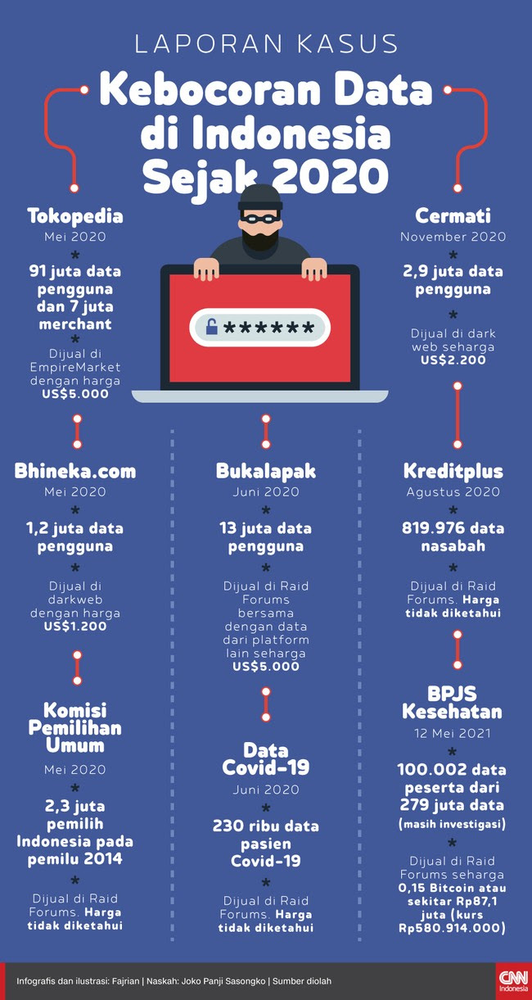
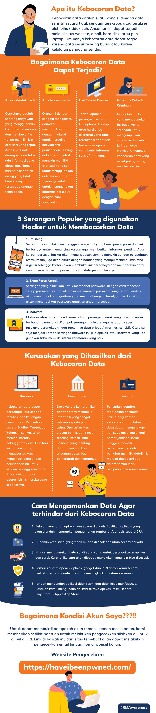

= Kebocoran Data dan Bagaimana Cara Menanggulanginya

Di era digital seperti saat ini, data memang menjadi salah satu aset yang paling bernilai. Tidak heran jika semakin banyak cyber hacker yang berusaha mencari kelemahan sistem dan meretasnya untuk mendapatkan akses ke data/informasi sensitif perusahaan/organisasi/individu. 

Beberapa waktu yang lalu, kasus kebocoran data kembali terjadi di Indonesia. Kali ini, https://www.cnnindonesia.com/teknologi/20210606200515-185-650991/kebocoran-data-pribadi-bpjs-kesehatan-bakal-digugat?utm_source=Alterra&utm_campaign=dc7afe11b0-EMAIL_CAMPAIGN_2020_03_03_06_54_COPY_02&utm_medium=email&utm_term=0_e087ca5e85-dc7afe11b0-342314953[ada sekitar 279 juta data penduduk Indonesia yang diduga milik peserta BPJS Ketenagakerjaan bocor] dan dijual dalam _hacker Raid Forums_. Beberapa data yang diduga bocor adalah nomor kartu peserta BPJS, kode kantor BPJS, data keluarga, tanggungan jaminan kesehatan, hingga status pembayaran jaminan. 

Berikut infografik laporan kasus kebocoran data di Indonesia sejak tahun 2020.

[.text-center]
sumber: https://www.cnnindonesia.com/teknologi/20210523132216-188-645888/infografis-rentetan-kebocoran-data-di-indonesia-sejak-2020?utm_source=Alterra&utm_campaign=dc7afe11b0-EMAIL_CAMPAIGN_2020_03_03_06_54_COPY_02&utm_medium=email&utm_term=0_e087ca5e85-dc7afe11b0-342314953[CCN Indonesia]

Dari rentetan kasus kebocoran data tersebut, kita dapat mengambil benang merah bahwa siapapun dapat menghadapi risiko kebocoran data, mulai dari individu hingga perusahaan tingkat tinggi atau pemerintah sekalipun.

Data-data yang berhasil dicuri oleh para hacker, biasanya akan digunakan untuk melakukan serangan lain berbasis _social engineering_ seperti _email phishing_. Selain itu, hacker juga bisa menjual kredensial pengguna ke dalam _Dark Web_. 

Agar kita lebih memahami apa itu kebocoran data beserta pencegahannya, yuk simak infografik berikut ini!

