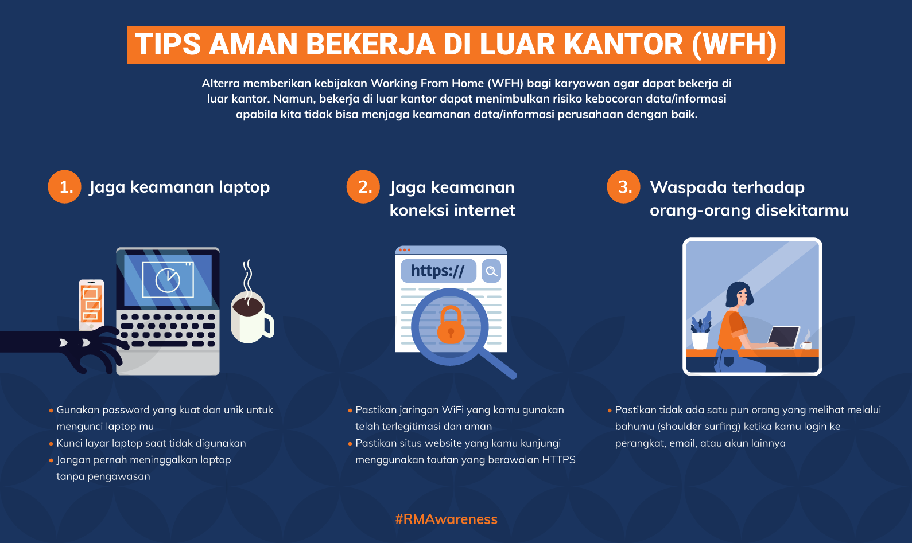

= Taking Your Work Home: Are You Secure?

Di masa pandemi ini, Alterra memberikan kebijakan karyawannya untuk dapat bekerja di rumah atau di luar kantor. Nah, di luar kebijakan tersebut, aman kah bekerja di luar kantor? Ada beberapa risiko yang dapat terjadi. Di antaranya adalah kebocoran data perusahaan. 

Bagaimana cara menjaga data dengan baik? Yuk, simak beberapa tips berikut!

