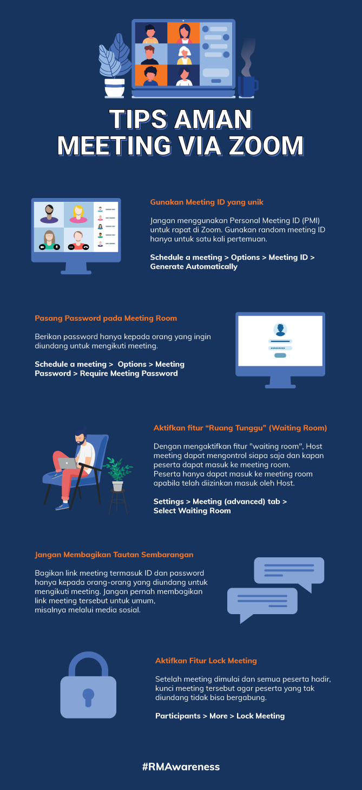

= Waspada ZoomBombing, Ini Tips Aman Meeting via Zoom!

Di tengah pandemi COVID-19 yang mengharuskan kita untuk bekerja dari rumah (WFH), membuat kita bergantung pada aplikasi video _conference_ seperti Zoom, Hangouts, Skype, dan media _conference call_ lainnya untuk _online meeting_.

Namun tahukah kamu, bahwa dengan meningkatnya penggunaan aplikasi _video conference_ seperti Zoom memunculkan risiko baru terkait keamanan informasinya. Hal tersebut dikarenakan saat ini semakin banyak _cybercriminal_ yang berusaha untuk mendapatkan akses ilegal untuk masuk ke _virtual meeting room_ orang lain. Fenomena tersebut dikenal sebagai _Zoom Bombing_. 

_Cybercriminal_ yang berhasil masuk ke _virtual meeting room_ kamu, dapat dengan mudah memperoleh informasi personal yang kamu share atau bahkan informasi rahasia perusahaan. Bahaya sekali bukan?!

Oleh karena itu, yuk kita jaga keamanan informasi _virtual meeting room_ kita dari ancaman _cybercriminal_ diluar sana dengan mengikuti tips berikut ini!

