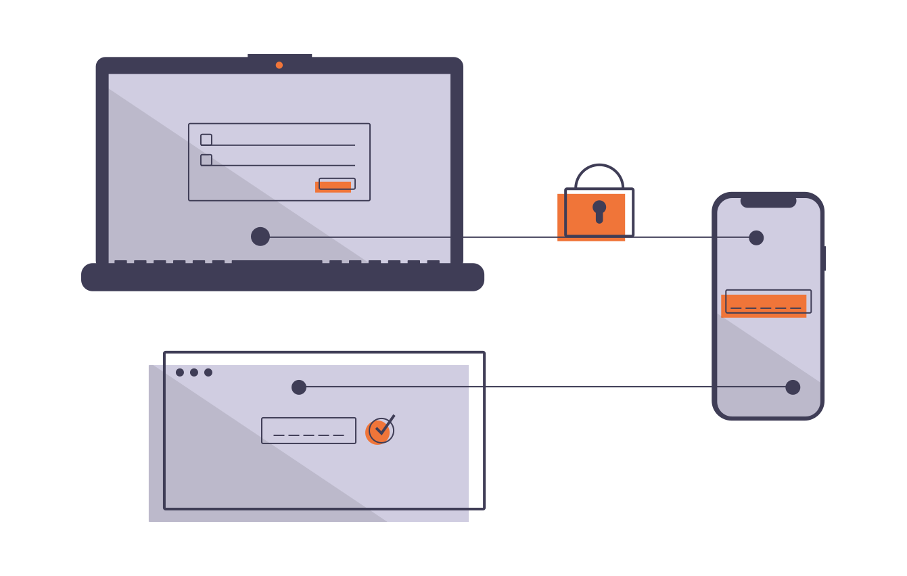

= Risk Awareness

Kemajuan teknologi internet ternyata juga memiliki dampak dan potensi risiko. Potensi risiko ini dapat berupa keamanan aset informasi oleh _cybercrime_ maupun lainnya.

Untuk meminimalisir potensi risiko tersebut, Tim Risk Management menyediakan beberapa artikel yang dapat kamu baca dan terapkan.

link:./Clean-Screen-and-Clean-Desk.adoc[Clean Screen and Clean Desk] +
link:./Taking-Your-Work-Home-Are-You-Secure.adoc[Taking Your Work Home: Are You Secure?] +
link:./Danger-of-Phising.adoc[Danger of Phising!] +
link:./Waspada-Zoom-Bombing.adoc[Waspada ZoomBombing, Ini Tips Aman Meeting via Zoom!] +
link:./Data-Pribadi-Rentan-Bocor.adoc[Data Pribadi Rentan Bocor di Internet? Ini Tips Amannya] +
link:./Apa-yang-Dimaksud-dengan-Cracker.adoc.adoc[Apa yang Dimaksud dengan Cracker?] +
link:./Kebocoran-Data-dan-Bagaimana-Cara-Menanggulanginya.adoc[Kebocoran Data dan Bagaimana Cara Menanggulanginya] +
link:./Cara-Hacker-Eksploitasi-Data-Pribadi-Seseorang.adoc[Jadi Gini Cara Hacker Eksploitasi Data Pribadi Seseorang!?] +
