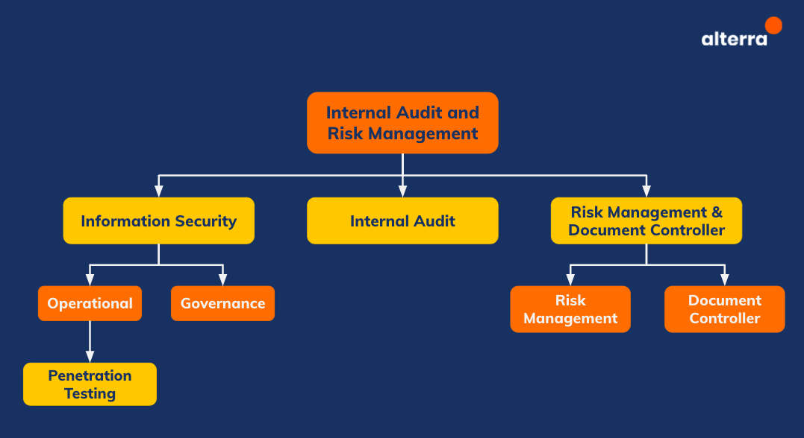

= Internal Audit and Risk Management

Divisi Internal Audit and Risk Management (IARM) bertanggung jawab dalam fungsi pengawasan internal serta melakukan pengendalian risiko baik dalam hal Informasi, Teknologi maupun Enterprise yang meliputi semua bagian risiko dalam perusahaan.

Sesuai dengan struktur di atas, Divisi IARM terbagi menjadi 3 Departemen, yaitu:

[arabic]
. link:./Information-Security/index.adoc[*Information Security*]
. link:./Internal-Audit/index.adoc[*Internal Audit*]
. link:./Risk-Management-and-Document-Controller/index.adoc[*Risk Management & Document Controller*]
