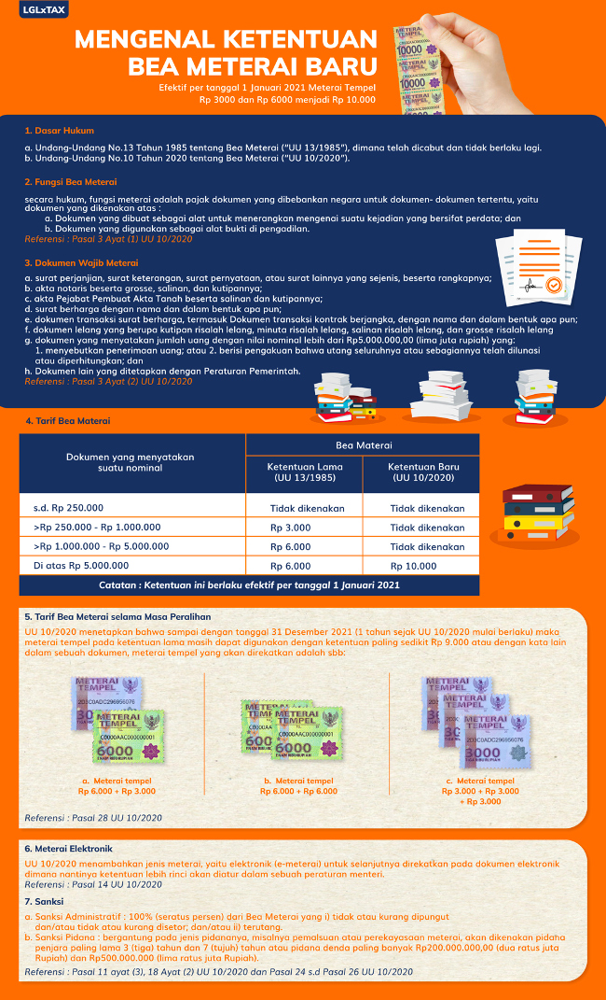

= Peraturan Baru atas Bea Meterai

Sesuai dengan peraturan pemerintah, per 1 Januari 2021, tarif bea meterai baru menjadi tarif tunggal, yaitu senilai Rp10.000 per lembar. Namun, sepanjang tahun 2021 meterai Rp3.000 dan Rp6.000 masih dapat digunakan sambil menunggu materai Rp10 ribu dirilis pemerintah.

Jadi, bagaimana ketentuan bea meterai baru ini? Yuk, simak infografis berikut.

