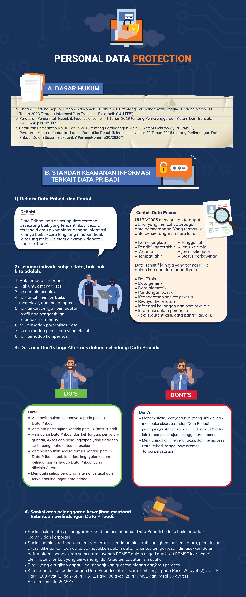

= Personal Data Protection

Data pribadi adalah setiap data tentang seseorang baik yang teridentifikasi secara sendiri maupun dikombinasikan dengan berbagai informasi lainnya, baik secara langsung maupun tidak langsung melalui sistem elektronik dan/atau non-elektronik. Data ini bersifat _confidential_ dan tidak seharusnya diketahui orang lain.

Data apa saja yang masuk ke dalam data pribadi? Bagaimana cara menjaganya? Yuk, simak infografis berikut.

