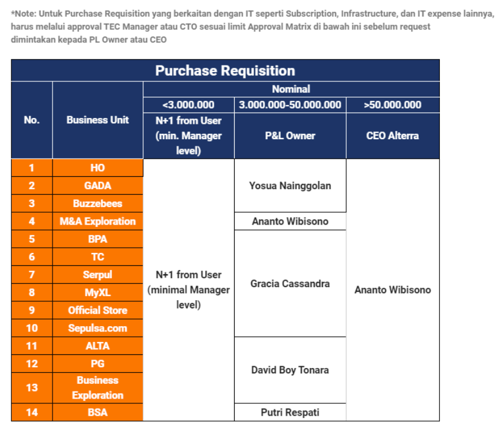

= Approval Matrix

_Approval Matrix_ untuk _Purchase Requisition_ (PR) dan _Purchase Order_ (PO)

Menyesuaikan dengan _Approval matrix_ terbaru yang sudah disetujui oleh Management team, berikut ini disampaikan yang akan diberlakukan per saat ini. 

_Approval matrix_ ini berlaku untuk permintaan pengadaan barang melalui _Purchase Requisition_ (PR)

* Setiap permintaan pengadaan tersebut, mohon bantuan _requestor_ untuk meminta _approval_ kepada P&L Owner sesuai Business Unit (BU) dan nominal _expense_ sesuai tabel di bawah ini.
* Approval dapat diajukan melalui _email_ disertakan saat mengirimkan _request Purchase Requisition_ (PR).
* Mohon dicatat untuk pengeluaran di atas 50 juta, sebelum meminta _approval_ kepada Mas Ananto (Multiple Layers of Approval Method), tetap diperlukan _approval_ dari P&L Owner terkait.

* Jika permintaan pengadaan barang yang dilakukan melalui _Purchase Requisition_ (PR) telah disetujui, maka PR tersebut akan diteruskan ke tahap _Purchase Order_ (PO) oleh tim Procurement. Adapun _approval matrix_ pada tahap PO bisa dilihat pada tabel berikut.

* Sebagai tambahan, tidak disarankan untuk melakukan _split expenses_ menjadi nominal kecil, untuk menghindari _layer approval_ yang lebih tinggi

Jika ada pertanyaan lebih lanjut, bisa langsung menghubungi email procurement@alterra.id 
