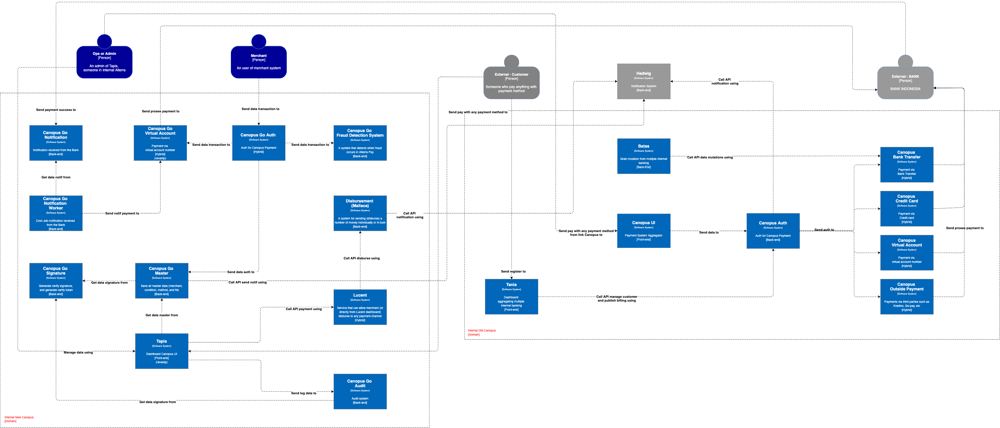

= Alterra Pay C1 Diagram

Alterra Pay merupakan inisiatif Head Office yang berfokus dalam pengelolaan keuangan dan sistem pembayaran. Inisiatif ini mencakup beberapa sistem yang saling terhubung, yang dapat dirangkum dalam diagram C1 berikut:

Berikut adalah sistem-sistem yang termasuk dalam inisiatif Alterra Pay:

1. link:../../../../../../System-Documents/Canopus-BT/architecture-canopus-bt.adoc[Canopus BT]

2. link:../../../../../../System-Documents/Canopus-CC/architecture-canopus-cc.adoc[Canopus CC]

3. link:../../../../../../System-Documents/Canopus-OP/architecture-canopus-op.adoc[Canopus OP]

4. link:../../../../../../System-Documents/Canopus-V2/architecture-canopus-v2.adoc[Canopus VA]
