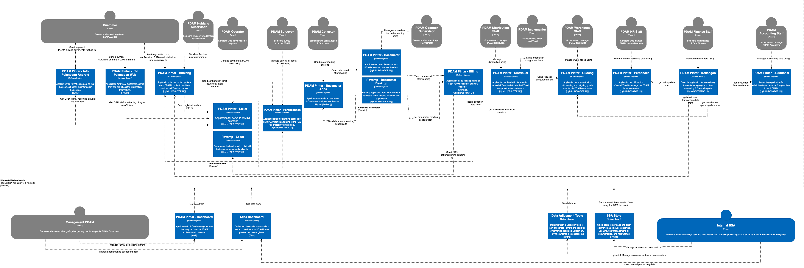

= Bimasakti Alterra C1 Diagram

Bimasakti Alterra (BSA) merupakan _company_ di bawah Alterra yang berfokus pada pengembangan berbagai inisiatif, baik untuk PDAM ataupun lainnya. Inisiatif PDAM mencakup beberapa sistem yang saling terhubung, yang dapat dirangkum dalam diagram C1 berikut:

Berikut adalah sistem-sistem yang termasuk dalam inisiatif BSA:

1. link:../../../../../../Business-Initiatives/Bimasakti-Alterra/System-Documents/Baca-Net/architecture-bacameter.adoc[Bacameter.NET]

2. link:../../../../../../Business-Initiatives/Bimasakti-Alterra/System-Documents/Distribusi-Web-PDAM/architecture-Distribusi-Web-PDAM.adoc[Dashboard Web PDAM]

3. link:../../../../../../Business-Initiatives/Bimasakti-Alterra/System-Documents/Distribusi-Web-PDAM-Gianyar/architecture-Distribusi-Web-PDAM-Gianyar.adoc[Dashboard Web PDAM Gianyar]

4. link:../../../../../../Business-Initiatives/Bimasakti-Alterra/System-Documents/Loket-Net/architecture-loket.adoc[Loket.NET]

5. link:../../../../../../Business-Initiatives/Bimasakti-Alterra/System-Documents/PDAM-Info/architecture-PDAM-Info.adoc[PDAM Info]

6. link:../../../../../../Business-Initiatives/Bimasakti-Alterra/System-Documents/SiPintar-Loket-ver-4/architecture-SiPintar-Loket-ver-4.adoc[SiPintar Loket V4]
