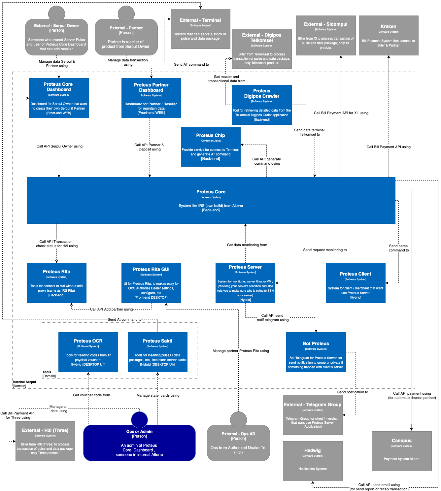

= Serpul C1 Diagram

Inisiatif Serpul mencakup beberapa sistem yang saling terhubung, yang dapat dirangkum dalam diagram C1 berikut:

Berikut adalah sistem-sistem yang termasuk dalam inisiatif Serpul:

1. link:../../../../../Business-Initiatives/Alterra-Bills/System-Documents/Proteus-Chip/architecture-proteus-chip.adoc[Proteus Chip]

2. link:../../../../../../Business-Initiatives/Alterra-Bills/System-Documents/Proteus-Core/architecture-proteus-core.adoc[Proteus Core]

3. link:../../../../../../Business-Initiatives/Alterra-Bills/System-Documents/Proteus-Core-Dashboard/architecture-proteus-core-dashboard.adoc[Proteus Core Dashboard]

4. link:../../../../../../Business-Initiatives/Alterra-Bills/System-Documents/Proteus-Partner-Dashboard/architecture-proteus-partdas.adoc[Proteus Partner Dashboard]

5. link:../../../../../../Business-Initiatives/Alterra-Bills/System-Documents/Proteus-Rita/architecture-proteus-rita.adoc[Proteus Rita]

6. link:../../Quality-Architect-Rating-Standard/index.adoc[back1]
7. link:../Quality-Architect-Rating-Standard/index.adoc[back2]

6. link:../../[back11]
7. link:../[back22]
8. link:Telco-C1-Diagram.adoc[back33]
9. link:./Telco-C1-Diagram.adoc[back44]

