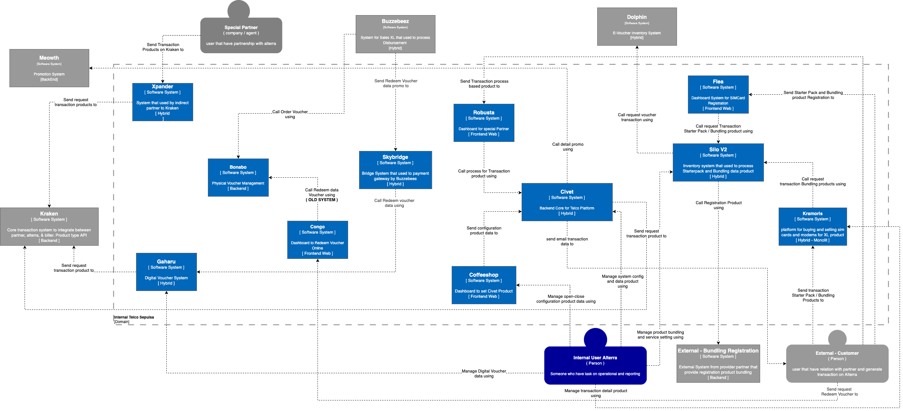

= Telco C1 Diagram

Telco merupakan inisiatif Alterra Bills yang berfokus dalam App Support, Starter Pack, dan sebagainya. Inisiatif ini mencakup beberapa sistem yang saling terhubung, yang dapat dirangkum dalam diagram C1 berikut:

Berikut adalah sistem-sistem yang termasuk dalam inisiatif Telco:

1. link:../../../../../../Business-Initiatives/Alterra-Bills/System-Documents/Civet/architecture-civet.adoc[Civet]

2. link:../../../../../../Business-Initiatives/Alterra-Bills/System-Documents/CoffeeShop/architecture-coffeeshop.adoc[CoffeeShop]

3. link:../../../../../../Business-Initiatives/Alterra-Bills/System-Documents/Flea/architecture-flea.adoc[Flea]

4. link:../../../../../../Business-Initiatives/Alterra-Bills/System-Documents/Gaharu/../architecture-gaharu.adoc[Gaharu]

5. link:../../../../../../Business-Initiatives/Alterra-Bills/System-Documents/Kramoris/architecture-kramoris.adoc[Kramoris]

6. link:../../../../../../Business-Initiatives/Alterra-Bills/System-Documents/Robusta-V2/architecture-robusta-v2.adoc[Robusta V2]

7. link:../../../../../../Business-Initiatives/Alterra-Bills/System-Documents/Silo-V2/architecture-silo-v2.adoc[Silo V2]

8. link:../../../../../../Business-Initiatives/Alterra-Bills/System-Documents/Xpander/architecture-xpander.adoc[Xpander]

