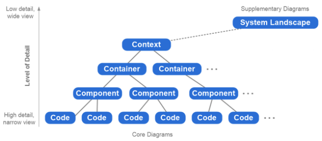
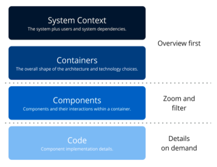

= Alterra System C1 Diagram

C1 Diagram adalah sebuah diagram yang menggambarkan satu/kumpulan sistem dan relasinya antar satu/kumpulan sistem lain, serta interaksi aktor (internal/eksternal) dengan sistem (internal/eksternal.) Diagram ini merupakan bagian dari _https://c4model.com/[framework C4 Model Diagram]_ yang digagas oleh Simon Brown, dimana C1 merupakan level teratas (jika tidak ada tambahan diagram _landscape_ yang lebih menjelaskan secara _high level_) untuk C4 model. 

C1 Diagram ini bisa disebut juga _Context Diagram_, sedangkan C2 Diagram atau Architecture Diagram yang ada di tiap-tiap sistem disebut dengan _Container Diagram_. C3 Diagram menjelaskan komponen _logic_ ataupun _services_ yang terdapat dalam satu sistem, sehingga disebut dengan _Component Diagram_. Terakhir, terdapat C4 Diagram yang menjelaskan implementasi dari C3 dalam _coding_, yang biasa disebut dengan _Code Diagram_. Untuk lebih jelasnya terkait C4 Diagram, yuk kita cek gambar di bawah ini :

Dalam Alterra, kita hanya memakai C1 dan C2 diagram. Diagram C2 sendiri, dapat diakses dalam halaman Architecture masing-masing sistem, sementara diagram C1 terangkum dalam tabel di bawah ini. Setiap diagram menjelaskan relasi antar sistem dalam tiap inisiatif bisnis dan aktor yang terlibat di dalamnya. 

[cols="50%,50%",frame=all, grid=all]
|===
^.^h| *Business Unit*
^.^h| *Initiative Name*

1.3+^.^| Head Office
a| link:./Alterra-Pay-C1-Diagram.adoc[Alterra Pay]

|link:./Data-C1-Diagram.adoc[Data]

|link:./ERP-C1-Diagram.adoc[ERP]

1.4+^.^| Alterra Bills
a| link:./Sepulsa-C1-Diagram.adoc[Sepulsa]

|link:./BPA-C1-Diagram.adoc[Bill Payment Agregator]

|link:./Telco-C1-Diagram.adoc[Telco]

|link:./Serpul-C1-Diagram.adoc[Serpul]

^.^| Bimasakti Alterra
a| link:./BSA-C1-Diagram.adoc[BSA]
|===
