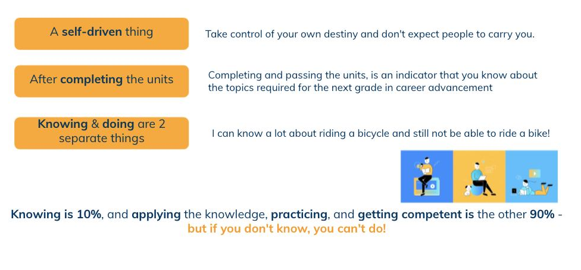

= Software Engineering Learning Program

== How Does It Work?

Have you read link:../Software-Engineering-Rating-Standard/index.adoc[Software Engineering Rating Standard] in Alterra? If it’s yes, you will be able to know what the difference is between the grades. Here is the targeted outcomes based training to grow someone from *SE13 to SE14*.

> Click on each unit to enrol the class. It will be better if you take the units according to the order of table below.

[cols="20%,10%,30%,40%",frame=all, grid=all]
|===
^.^h| *Domain* 
^.^h| *Core Unit* 
^.^h| *Topics* 
^.^h| *Learning Outcomes*

1.2+^.^|Process
1.2+^.^|https://classroom.google.com/c/MjcxMzM3NDI4MDY2?cjc=htlfxqg[PRO-200]
|Alterra: Applied JIRA workflow
a|- Understand and define JIRA workflow in Alterra
- Use JIRA as project management tools properly
- Identify stories and write with INVEST principles properly

|Alterra: Introduction to CD3
a|- Identify and write CD3 components, and calculate them 
- Learn how to prioritize the start order of work to optimize delivered value & minimze the CoD

1.2+^.^|Sustainment
1.2+^.^|https://classroom.google.com/c/MjYzNjg3NDExNTEw?cjc=rikahe6[SUS-200]
|Introduction to Refactoring
a|- Define code smell and refactoring 
- Understand why refactoring is used 
- Identify common “basic” code smells 
- Identify or suggest situations where simple refactoring strategies can be used 

|Introduction to DevOps
a|- Implement docker for your system that can run everywhere without code change 
- Understand how we can dynamically change behaviour of system without code change 
- Have a clue what happen after you push your code to github 
- Aware about system monitoring in the wild

1.3+^.^|Config Management
1.2+^.^|https://classroom.google.com/c/MTcyOTc1ODM1Nzc5?cjc=qesldis[CFG-200]
|Introduction to Configuration Management
a|- Understand the difference between configuration and change management
- Identify and implement DevOps priciples 
- Define 12-factor

|Alterra: Configuration Management in DevOps
a|- Identify configuration management in Devops & database 
- Define source code & artifact repository
- Implement knowledge to choose or combine the tools that will be used

^.^|https://classroom.google.com/c/Mjc3NjkyNzc2MzAw?cjc=x6u3yc2[CFG-202]
|Introduction to the Hexagonal Architecture
a|- Learn how hexagonal architecture works in Alterra 
- Know how to use the knowledge for work needs

^.^|Quality
^.^|https://classroom.google.com/c/MjExMjU4MDUyMDY2?cjc=xzqifzq[QUA-200]
|Introduction to Testing Methods
a|- List a range of different software testing techniques and statergies and be able to apply specific (automated) unit testing method to the projects 
- Distinguish characterstics of structural testing methods

1.3+^.^|System Engineering
1.3+^.^|https://classroom.google.com/c/Mjc0OTk3MzEwMzk2?cjc=ux43hmn[ENG-200]
|Introduction to Project Management
a|- Understand agile project management characteristics and know how to implement 
- Recognize the components of a kanban board and how to be appropriately scale them based on the size of a project 
- Keep projects on track by managing project risks and effectively using a communication plan

|Introduction to Integration Testing
a|- Get in-depth knowledge on integration testing and why it is important to subject software builds to integration tests 
- Distinguish characterstics of integration testing

|Introduction to E2E Testing
a|- Define and employ correct testing terminology throughout the testing process 
- Write automated functional test with well-defined objectives and targets

1.6+^.^|Construction
1.6+^.^|https://classroom.google.com/c/MjQ5MTE1NzY4Njg4?cjc=flxup7y[CST-150]
|Data Structures
a|- Identify and apply knowledge of data structures, arrays & memory, trees, and stacks & queues appropriate to the daily task 
- Implement and evaluate linked list to meet desired needs (abstract data types) 
- Analyze a problem, and identify and define the classes & objects appropriate to its requirement

|Order of Magnitude
a|- Learn how to run time scales with respect to some input variables 
- Understand big O in an effective way and implement the code

|Hashing (Uniform)
a|- Use current techniques, skills, and tools necessary for hashing practice 
- Define hash functions and its impact performance

|Database Indexing
a|- Use current techniques, skills, and tools necessary for database indexing practice 
- Understand the fundamental and how to select for best index building 
- Identify the worst problem indexes and eliminate them

|Caching
a|- Use and apply current technical concepts and practices in the daily task 
- Learn how to not caching

|Async Programming
a|- Understand the difference between async & sync programming 
- Identify and implement how & when would you use Async

1.3+^.^|Requirements
1.3+^.^|https://classroom.google.com/c/MjQ3NDI0MDYzNTk2?cjc=dzpii4n[REQ-200]
|Customer is Important
a|- Understand the customer affinity and how to implement it on a daily needs 
- Use technical knowledge to come up with new stories that seem to fit the product owner's vision

|Product Requirements
a|- Use JIRA as project requirements documentation tools properly 
- Identify and define PRD for requirements engineering needs 
- Define processes for requirements engineering and know how to apply them with guidance

|Introduction to Domain Driven Design
a|- Use an Event Storming and bounded text on an ongoing basis 
- Learn about strategic domain-driven design (basic knowledge) and implement the code itself 
- Learn how to design and code out a system using domain-driven design through video materials

1.3+^.^|Design
1.3+^.^|https://classroom.google.com/c/Mjc0OTk3MzEwMjYw?cjc=dcnjxoi[DES-200]
|Software Patterns
a|- Identify the appropriate design patterns to solve object oriented design problems 
- Apply structural patterns to solve design problem 
- Construct design solutions by using behavioral patterns

|Introduction to Software Architecture
a|- Understand the architecture, creating it and moving from one to any, different structural patterns 
- Analyze the architecture and build the system from the components 
- Apply design and development tools and processes needed to construct software in a systematic manner (clean architecture)

|Introduction to Distributed Systems
a|- Understand Distributed System techniques, processes, & the importance 
- List the principles of distributed systems and describe the problems and challenges associated with these principles

1.2+^.^|Measurement
1.2+^.^|https://classroom.google.com/c/MjQ3MzEzMDI2OTUw?cjc=ahjkgdy[MEA-200]
|Introduction to APM
a|- Define APM and understand its importance 
- Apply key consideration to buy or build APM 
- Understand APM tools comparison

|Performance Management
a|- Understand performance monitoring and it's impact  
- Implement step by step Prometheus installation

|===

== What's Next? 

Here are the things you can do after enrol all courses.
* *Take your time to learn* new things and practice
* Let's *test your knowledge* with our quiz 
* Send your feedback by filling each unit’s form, or email us through learning@alterra.id 

> Get your course completion E-certificates by filling http://bit.ly/lhalterra

== Why do we need it?   

2021 looking forward. We want to be *the best Technology Team in Indonesia*. What should we do to achieve that? https://drive.google.com/file/d/1JNdmi5ZV9gYRkZWv5gqeMAKR6W5IpHie/view[Watch this] till the end! 

Watch the full version with subtitles https://drive.google.com/file/d/1tia8x9LWQZcOSR0YBMiZsMOSllfg67LG/view[here]

== Any questions? 

If you have a question or something to discuss about this topic, post your questions through https://alterra.tribe.so/login?redirect=/[Tribe] or email us through learning@alterra.id 