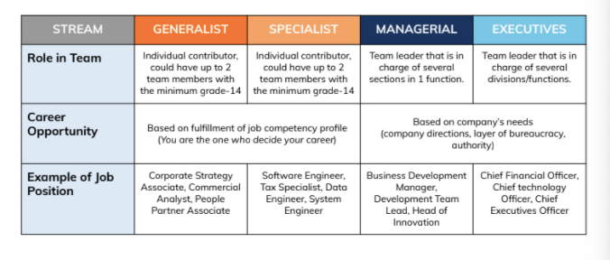

= Software Engineering Rating Standard

Alterra adopt dual career path, *Technical Track (Specialist & Generalist)* and *Managerial Track (Managerial)*.

Each role, in each track, at each level will be assigned a spesific set of desired competencies, include Software Engineer. link:../Software-Engineering-Competency-Matrix/index.adoc[Click here] to read more about technical competencies for Software Engineer.

Now you know about technical competencies, let’s find out the next step. Gap analysis is the process of specifying the competencies an individual or organization has, the competencies needed, and gaps between what is had and what is needed. A career grade is then defined as the expected level of competency in each domain.

The goal is Software Engineer will use the competency matrix & rating standard to evaluate their technical competencies for the purposes of selfevaluation and improvement. Here is an output from gap analysis, a rating standard for competencies from Software Engineering skill areas.

== Technical Track

[cols="20%,20%,9%,9%,9%,9%,9%,9%,9%,9%",frame=all, grid=all]
|===
2.2+^.^h|*Technical Domain* 
8+^.^|*Min. Fulfilment Percentage*

^.^h|*13A*
^.^h|*13B*
^.^h|*14A*
^.^h|*14B*
^.^h|*15A*
^.^h|*15B*
^.^h|*16A*
^.^h|*16B*

1.5+^.^h|*Lifecycle [1-4]*
^.^|Requirement
^.^|1
^.^|1
^.^|2
^.^|2
^.^|2
^.^|3
^.^|3
^.^|3

^.^|Design
^.^|1
^.^|1
^.^|1
^.^|2
^.^|2
^.^|3
^.^|3
^.^|4

^.^|Construction
^.^|2
^.^|3
^.^|3
^.^|3
^.^|3
^.^|3
^.^|3
^.^|4

^.^|Testing
^.^|1
^.^|2
^.^|2
^.^|2
^.^|2
^.^|3
^.^|3
^.^|3

^.^|Suistainment
^.^|1
^.^|1
^.^|1
^.^|2
^.^|2
^.^|3
^.^|3
^.^|3

1.7+^.^h|*Cross-cutting [1-4]*
^.^|Process
^.^|1
^.^|1
^.^|2
^.^|2
^.^|2
^.^|3
^.^|3
^.^|3

^.^|System Engineering
^.^|1
^.^|1
^.^|2
^.^|2
^.^|3
^.^|3
^.^|3
^.^|3

^.^|Quality
^.^|1
^.^|1
^.^|2
^.^|2
^.^|3
^.^|3
^.^|3
^.^|3

^.^|Security
^.^|1
^.^|1
^.^|1
^.^|1
^.^|3
^.^|2
^.^|2
^.^|3

^.^|Config Management
^.^|1
^.^|1
^.^|2
^.^|2
^.^|3
^.^|3
^.^|3
^.^|3

^.^|Measurement
^.^|1
^.^|1
^.^|2
^.^|2
^.^|2
^.^|2
^.^|2
^.^|3

^.^|HCI
^.^|1
^.^|1
^.^|1
^.^|1
^.^|2
^.^|2
^.^|2
^.^|2

2.2+^.^h|*Total*
^.^|*13*
^.^|*15*
^.^|*22*
^.^|*23*
^.^|*30*
^.^|*33*
^.^|*33*
^.^|*37*

|===

*Note*: Total Percentage, with #minimum in each domain minimum rating attached#.

== Managerial Track

[cols="20%,20%,10%,10%,10%,10%,10%,10%",frame=all, grid=all]
|===
2.2+^.^h|*Technical Domain* 
6+^.^h|*Min. Fulfilment Percentage*

^.^h|*14A*
^.^h|*14B*
^.^h|*15A*
^.^h|*15B*
^.^h|*16A*
^.^h|*16B*

1.5+^.^h|*Lifecycle [1-4]*
^.^|Requirement
^.^|2
^.^|2
^.^|3
^.^|3
^.^|3
^.^|4

^.^|Design
^.^|1
^.^|2
^.^|2
^.^|3
^.^|3
^.^|3

^.^|Construction
^.^|2
^.^|1
^.^|3
^.^|2
^.^|2
^.^|2

^.^|Testing
^.^|1
^.^|1
^.^|2
^.^|2
^.^|2
^.^|2

^.^|Suistainment
^.^|1
^.^|1
^.^|2
^.^|2
^.^|2
^.^|2

1.7+^.^h|*Cross-cutting [1-4]*
^.^|Process
^.^|2
^.^|2
^.^|3
^.^|3
^.^|3
^.^|4

^.^|System Engineering
^.^|1
^.^|1
^.^|2
^.^|2
^.^|2
^.^|2

^.^|Quality
^.^|1
^.^|1
^.^|2
^.^|2
^.^|2
^.^|3

^.^|Security
^.^|1
^.^|1
^.^|1
^.^|2
^.^|2
^.^|2

^.^|Config Management
^.^|1
^.^|1
^.^|2
^.^|2
^.^|2
^.^|3

^.^|Measurement
^.^|1
^.^|2
^.^|2
^.^|3
^.^|3
^.^|3

^.^|HCI
^.^|1
^.^|1
^.^|1
^.^|2
^.^|2
^.^|2

2.2+^.^h|*Total*
^.^|*15*
^.^|*16*
^.^|*25*
^.^|*28*
^.^|*28*
^.^|*32*

|===

*Note*: Total Percentage, with #minimum in each domain minimum rating attached#.

== Any questions?

If you have a question or something to discuss about this topic, post your questions through https://alterra.tribe.so/login?redirect=/[Tribe].
