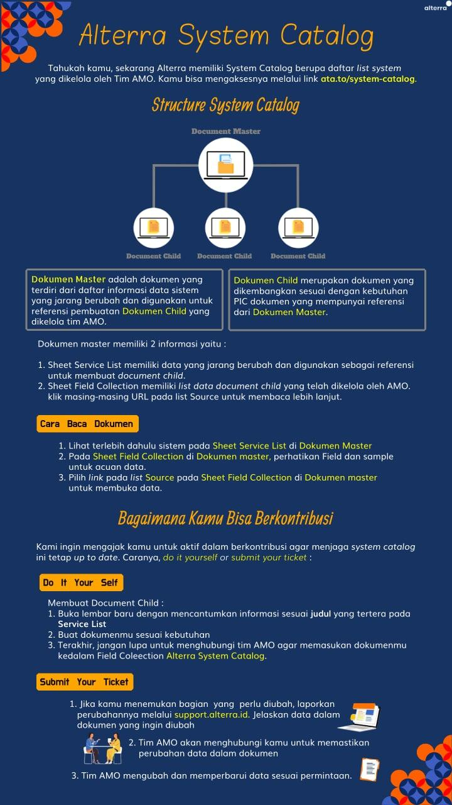

= Alterra System Catalog

_System Catalog_ adalah sekumpulan tabel dan tampilan yang menggabungkan detail penting mengenai database dari sistem yang ada diperusahaan tersebut. Data ini hanya diberikan untuk _role_ tertentu karena bersifat _confidential_.

Untuk menyajikan informasi seluruh sistem yang ada di Alterra, tim AMO telah menyediakan katalog sistemnya untukmu. Bagaimana caranya? yuk cek infografis di bawah ini.

Link berikut yang bisa kamu akses untuk   link:https://docs.google.com/spreadsheets/d/1zQFVgP3P74sKM_i0hIE8VmmR2DERrLDe6pUT0ZvzD9o/edit#gid=0[Alterra System Catalog]