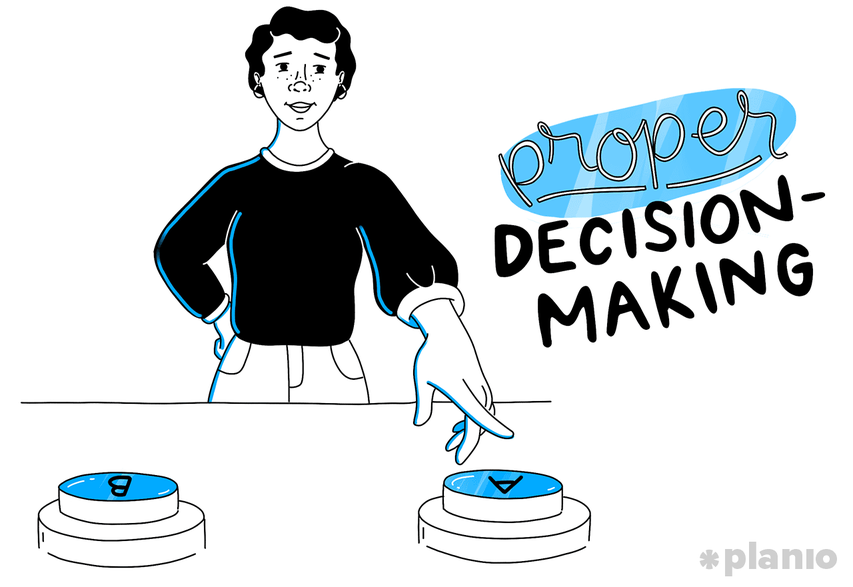

= Consulting and Support Skill Area

Consulting and support organization include providing project administrative support, consulting and mentoring, serving as a Center of Expertise (CoE) for agile management, and being the first point of contact for questions regarding PM processes, standards, reporting requirements,etc.

[cols="20%,20%,20%,20%,20%",frame=all, grid=all]
|===
1.3+^.^h|*Key Behavior* 
4+^.^h|*Proficiency Level*

^.^h|*1*
^.^h|*2*
^.^h|*3*
^.^h|*4*

^.^h|*Imitative*
^.^h|*Operative*
^.^h|*Adaptive*
^.^h|*Developmental*

a|Consulting Skills

*Description:*

Ability to identify and analyze problems and situations in order to provide working and effective advice.
|Collect project information following the standard procedure
|Identify a case or project plan and outline action steps
|Estimates consulting project and copes with scarce resources
|Gets appropriate management support and dealing with resistance

a|Project Recovery Skills

*Description:*

The effort and activities related to addressing troubled projects, either to stop it or drive it to completion.
|Listing troubled project indicators by following the standard procedure
|Compiles and validates general remedies used to correct project performance
|Develops capability to conduct project recovery activities
|Conducts project recovery analyses toward achieving goals of continuous improvement
|===

== Any question?

If you have a question or something to discuss about this topic, post your questions through https://alterra.tribe.so/login?redirect=/[Tribe].