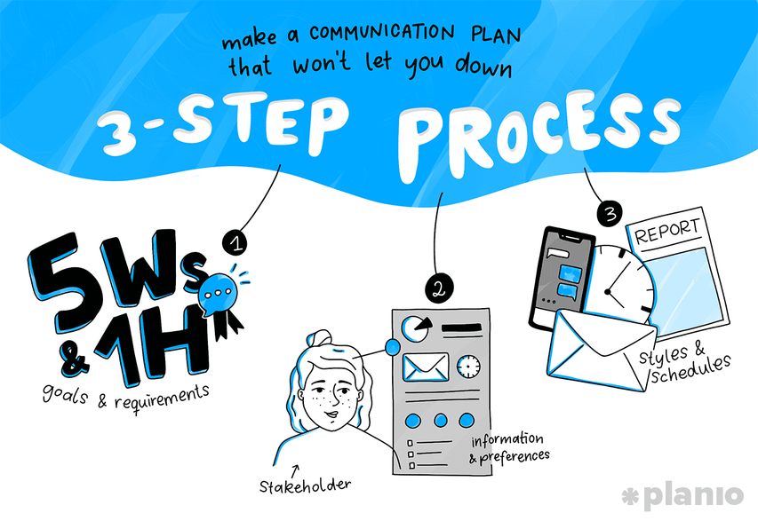

= Knowledge Management Skill Area

Knowledge management related to acquiring, organizing, maintaining, and disseminating knowledge and activities related training and professional development. 

[cols="20%,20%,20%,20%,20%",frame=all, grid=all]
|===
1.3+^.^h|*Key Behavior* 
4+^.^h|*Proficiency Level*

^.^h|*1*
^.^h|*2*
^.^h|*3*
^.^h|*4*

^.^h|*Imitative*
^.^h|*Operative*
^.^h|*Adaptive*
^.^h|*Developmental*

a|Project Knoledge Management Skills

*Description:*

Ability to create a knowledge culture within the organization through a focus on sharing relevant knowledge
|Prepare project plan, report,  and documents following the standard procedure
|Identify methods for compiling and using project lessons learned information and other feedback
|Design automated tools and practices for project knowledge management
|Expands knowledge management functionality for business use

a|Project Cost Management

*Description:*

Ability to ensure the project is completed within allocated budget.
|Prepare baseline plan budget, broken down by time period, task and cost account, as appropriate
|Identify what type and quantity of resources (such as people and equipment) are needed to complete the project activities
|Develops an estimate of the cost of each task by using quantity and cost of each resource needed to complete the project activities
|Control changes to the project budget, react to changes as appropriate and revise the budget as necessary
|===

== Any question?

If you have a question or something to discuss about this topic, post your questions through https://alterra.tribe.so/login?redirect=/[Tribe].