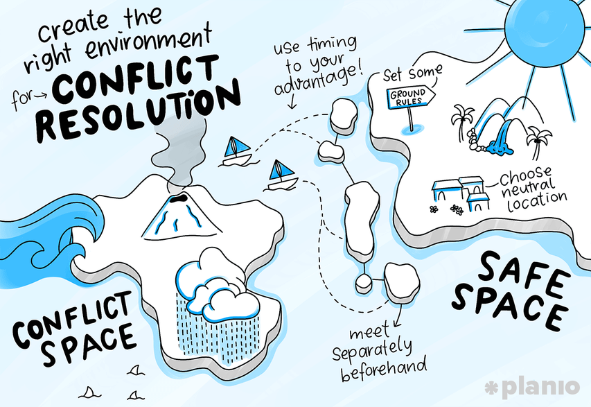

= Standard & Maintenance Skill Area

Standards maintenance means establishing and maintaining organizational agile management standards, processes, tools, and techniques. 

Standardization scope include but not limited to:

* Defining and enforcing standards for agile management processes across the organization.
* Utilizing standard tools and templates to perform agile management tasks.
* Maintaining standardized management reporting or project tracking to ensure a standard view of projects, progress, and issues across the organization
* Documented, repeatable processes ensure consistency and limit process risk throughout project lifecycle

[cols="20%,20%,20%,20%,20%",frame=all, grid=all]
|===
1.3+^.^h|*Key Behavior* 
4+^.^h|*Proficiency Level*

^.^h|*1*
^.^h|*2*
^.^h|*3*
^.^h|*4*

^.^h|*Imitative*
^.^h|*Operative*
^.^h|*Adaptive*
^.^h|*Developmental*

a|Method and Processes

*Description*:

Ability to structure activities, define and maintain processes, method, and tools. Agile specialist needs to have a process in place to manage quality and validate that the process is executed. 
|Applies effective practices for project performance and oversight
|Identify and analyze project management methodology, best practices, and standards
|Monitors use of a complete project management methodology to design new improvement
|Develop and manage project policies, procedures, templates, and other shared documentation

a|Standards & Metrics

*Description:*

Ability to establish and maintain organizational project standards processes, tools, and techniques.
|Applies approved standards and metric to agile management activities
|Identify and analyze basic standards and metrics to facilitate a consistent approach to agile management
|Implement more comprehensive standards and metrics to improve project performance
|Manages standards and metrics to help achieve functional organization objectives

a|Conflict Management

*Description:*

Ability to process of limiting the negative aspects of conflict while increasing the positive aspects of conflict. The aim of conflict management is to enhance learning and group outcomes, including effectiveness or performance in an organizational setting.
|Deals well with familiar surroundings and adapt to new situations and react to impasses from individuals or group of stakeholders
|Recognize situations of resistance or deadlocks, but needs greater time to develop relationships with stakeholders to help positively mitigate them
|Manages situations of substantial changes, conflict impasses through good relationship and interaction with stakeholders, as well as using negotiation techniques
|Internal and external customers recognize capacity for transparent relationships and motivation, even in adverse situations

a|Project Risk Management

*Description:*

Being aware of what could go wrong at any time, deciding if these risks can be managed or how they would affect the business and finally taking action to avoid either the problem or its consequences.
|Gathers the information to help identify and resolve the risks
|Identify potential risk using personal history or a risk database
|Monitor risk warning & events, respond as early as possible and document all actual risk event
|Reduce risk number for high level issue & number of high risk items

|===

== Any question?

If you have a question or something to discuss about this topic, post your questions through https://alterra.tribe.so/login?redirect=/[Tribe].