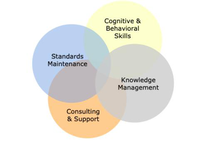

= Agile Management Specialist (AMO) Competency Matrix

== What is Agile Management Specialist (AMO) Technical Domain?

Technical skills refer to the specialized knowledge and expertise needed to accomplish complex actions, tasks, and processes. 

In AMO competency models there are 3 technical skill areas: Standards Maintenance, Knowledge Management, Consulting and Support. 

== What are skill sets for Agile Management Specialist (AMO) Technical Domain?

We divide it into three very different areas: Standards Maintenance, Knowledge Management, Consulting and Support. The degree to which competence (or even mastery) is useful in each area will be driven by the organizational and business context).

Standard & Maintenance Skill Area
Knowledge Management Skill Area
Consulting & Support Skill Area

* link:./Standard-and-Maintenance-Skill-Area.adoc[Standard and Maintenance Skill Area]
* link:./Knowledge-Management-Skill-Area.adoc[Knowledge Management Skill Area]
* link:./Consulting-and-Support-Skill-Area.adoc[Consulting and Support Skill Area]

== How far can you g(r)o(w)?

Find out your answer by learning about Alterra career track, link:../Agile-Management-Specialist-Rating-Standard/index.adoc[Agile Management Specialist (AMO) Rating Standard].

== Any question?

If you have a question or something to discuss about this topic, post your questions through https://alterra.tribe.so/login?redirect=/[Tribe].

== References

* Costa, A., Pinto, A., & Cota, M. (2013). PMO competencies: how to define, assess, and plan. Paper presented at PMI® Global Congress 2013—North America, New Orleans, LA. Newtown Square, Costa, A., Pinto, A., & Cota, M. (2013). PMO competencies: how to define, assess, and plan. Paper presented at PMI® Global Congress 2013—North America, New Orleans, LA. Newtown Square, https://www.pmi.org/learning/library/project-management-competencies-define-assess-plan-5925[Project Management Competencies How to Define Assess and Plan]
* Dietrich, P., Artto, K. A., & Kujala, J. (2010). Strategic priorities and PMO functions in project-based firms. Paper presented at PMI® Research Conference: Defining the Future of Project Management, Washington, DC. Newtown Square, PA: Project Management Institute.https://www.pmi.org/learning/library/project-management-office-functions-support-6435 
* Howe, Alan C. Maltz (2014). Function of the PMO I - Consulting, Knowledge & Standards. School of Technology Management Stevens Institute of Technology. https://slideplayer.com/slide/10517598/[Dr. Alan C. Maltz Howe School of Technology Management Stevens Institute of Technology Mgt Project Portfolio Management and. -  ppt download]
* Kerzner, Harold. Recovery Project Management: Techniques and Tactics for Reversing Failing Projects. International Institute for Learning, Inc. https://www.projectmanagement.com/pdf/recoverypmtechnique.pdf
* Martin, Sam & Abdelsadek, Kareem (2017). Managing an Agile program? Consider an AMO https://www2.deloitte.com/us/en/insights/industry/public-sector/agile-in-government-management-office.html[Managing an Agile program? Consider an AMO]
* Woerner, B. & Aziz, L. (2007). PMO leadership—a catalyst for accelerating growth within the information technology project management office. Paper presented at PMI® Global Congress 2007—North America, Atlanta, GA. Newtown Square, PA: Project Management Institute. https://www.pmi.org/learning/library/critical-skills-operate-pmo-7204[Critical Skills to Successfully Operate Project Management Office]