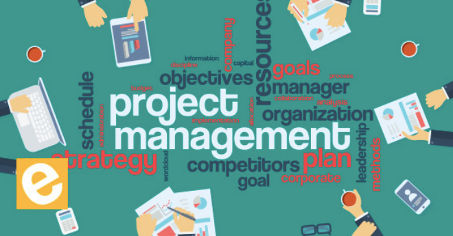

= Project Management Skill Area

Project management involves managing the operations of an individual project within a program. Project management is focused on creating deliverables as efficiently as possible, program management is focused on maximizing the benefits realized by the organization.

Project management is a bit more tactical than program management, it mainly focuses on the operational elements of the project such as meeting deadlines, staying within budget, and completing deliverables. The project manager coordinates time, budget, resources and delegates tasks across the team.

    Scroll down to read the entire Project and Program Management skill area.

[cols="20%,20%,20%,20%,20%",frame=all, grid=all]
|===
1.3+^.^h|*Key Behavior* 
4+^.^|*Proficiency Level*

^.^h|*1*
^.^h|*2*
^.^h|*3*
^.^h|*4*

^.^h|*Imitative*
^.^h|*Operative*
^.^h|*Adaptive*
^.^h|*Developmental*

a|Project Management Skills

*Description:*

Knowledge of organizational project management processes (e.g., waterfall, Agile) and problem-solving, leadership, and time-management skills to carry them out.
|Executes part of a project, monitors own progress, identifies obstacles and takes corrective actions
|Develop simple project plans and handles obstacles effectively
|Leads in developing and implementing complex project plans that have implications across business units or the organisation
|Champions projects that drive value creation and align them to organisational strategies
|===

== Any question?

If you have a question or something to discuss about this topic, post your questions through https://alterra.tribe.so/login?redirect=/[Tribe].