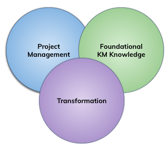

= Knowledge Management Competency Matrix

== What is Knowledge Management Officer (KM) Technical Domain?

Technical skills refer to the specialized knowledge and expertise needed to accomplish complex actions, tasks, and processes. 

There are three (3) technical skill areas in Knowledge Management (KM) competency models: Project Management, Foundational KM Knowledge, and Transformation. 

== What are skill sets for Knowledge Management Officer (KM) Technical Domain?

We divide it into three very different areas: Project Management, Foundational KM Knowledge, and Transformation. The degree to which competence (or even mastery) is useful in each area will be driven by the organizational and business context).

* link:./Project-Management-Skill-Area.adoc[Project Management Skill Area]
* link:./Foundational-KM-Knowledge-Skill-Area.adoc[Foundational KM Knowledge Skill Area]
* link:./Transformation-Skill-Area.adoc[Communication and Influence Skill Area]

== How far can you g(r)o(w)?

Find out your answer by learning about Alterra career track, link:../Knowledge-Management-Rating-Standard/index.adoc[Knowledge Management (KM) Rating Standard].

== Any question?

If you have a question or something to discuss about this topic, post your questions through https://alterra.tribe.so/login?redirect=/[Tribe].

== References

* Alterra Career Framework (2020). Jakarta: Alterra Group; https://drive.google.com/file/d/1XgQSGRJu48vn3PVT2eAXULYTGYelfmWF/view[URL].
* Ana Costa, Américo Pinto, Marcelo Cota (2013). PMO competencies: how to define, assess, and plan. Paper presented at PMI® Global Congress 2013—North America, New Orleans, LA. Newtown Square, PA: Project Management Institute; https://www.pmi.org/learning/library/project-management-competencies-define-assess-plan-5925[URL].
* Anthony J. Rhem (2017). Knowledge Management in Practice. Florida: CRC Press; https://drive.google.com/file/d/1-8chI5IMnjHNYeeYQEtOGfcG3KctHomM/view[URL].
* Antonie Botha, Derrick Kourie, Retha Snyman (2008). Coping with Continuous Change in the Business Environment. Oxford: Chandos Publishing; https://drive.google.com/file/d/1UIvJZa1ISI0KcGzWR_hhOpViYT1VBKa2/view[URL].
* APQC (2019). Core Competencies for Knowledge Management Team; https://drive.google.com/file/d/1eVAK3GHilC6mMyc3Oy9NCZWyXl1Ogtdp/view[URL].
* CDC (2006). CDC Unified Process Practices Guide : Change Management; https://www2.cdc.gov/cdcup/library/practices_guides/CDC_UP_Change_Management_Practices_Guide.pdf[URL].
* Competency Framework; https://www.chg.org.uk/wp-content/uploads/2012/04/competency_framework.pdf[URL].
* IEEE Computer Society (2014). Software Engineering Competency Model; http://dahlan.unimal.ac.id/files/ebooks/SWECOM.pdf[URL].
* IBM (2020). The Data Science Skills Competency Model. New York: IBM Corporation; https://www.ibm.com/downloads/cas/7109RLQM[URL].
* Jacquie Samuels. Assessing the State of Your Content: Applying the Content Management System Maturity Model; https://techwhirl.com/content-management-system-maturity-model/[URL].
* Kimiz Dalkir (2005). Knowledge Management in Theory and Practice. Burlington: Elsevier; https://dianabarbosa.files.wordpress.com/2009/03/knowledge-management-kimiz-dalkir.pdf[URL].
* Lauren Trees (2020). The Skills Knowledge Managers Need Most; https://www.apqc.org/blog/skills-knowledge-managers-need-most[URL].
* Marsha Grant (2017). Competency Framework for SMS; https://docplayer.net/20810604-Competency-framework-for-sms.html[URL].
* Robert W. Eichinger, Michael M. Lombardo (2003). Education competencies: Conflict management; https://www.microsoft.com/en-us/education/training-and-events/education-competencies/conflict_management.aspx[URL].
* SCIE. Competencies for Knowledge Management; https://www.scie.org.uk/assets/elearning/knowledgemanagement/km08/object/assets/common/pdfs/competencies_for_knowledge_management.pdf?res=true[URL]. 