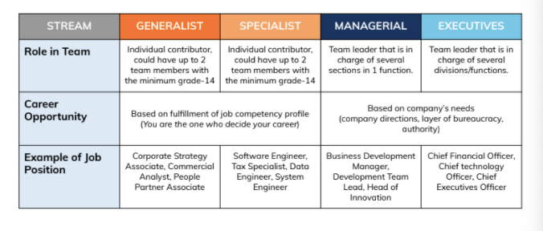

= Knowledge Management Rating Standard

Alterra adopt dual career path, *Technical Track (Specialist & Generalist)* and *Managerial Track (Managerial)*.

Each role, in each track, at each level will be assigned a specific set of desired competencies, include Knowledge Management Officer (KM). link:../Knowledge-Management-Competency-Matrix/index.adoc[Click here] to read more about technical competencies for Agile Management Specialist.

Now you know about technical competencies, let’s find out the next step. Gap analysis is the process of specifying the competencies an individual or organization has, the competencies needed, and gaps between what is had and what is needed. A career grade is then defined as the expected level of competency in each domain. 

The goal is Knowledge Management Officer (KM) will use the competency matrix & rating standard to evaluate their technical competencies for the purposes of self evaluation and improvement. Here is an output from gap analysis, a rating standard for competencies from Agile Management Specialist skill areas.

== Technical Track

[cols="20%,20%,8%,8%,8%,8%,8%",frame=all, grid=all]
|===
1.2+^.^h|*Technical Domain* 
1.2+^.^h|*Key Behaviour* 
5+^.^h|*Min. Fulfilment Percentage*

^.^h|*12*
^.^h|*13A*
^.^h|*13B*
^.^h|*14A*
^.^h|*14B*

^.^h|*Project and Program Management*
|Project Management
^.^|1
^.^|2
^.^|3
^.^|3
^.^|4

1.4+^.^h|*Foundational KM Knowledge*
|Content Management
^.^|2
^.^|2
^.^|4
^.^|4
^.^|4

|KM Tools
^.^|1
^.^|2
^.^|3
^.^|3
^.^|3

|Data Analytics
^.^|1
^.^|2
^.^|2
^.^|3
^.^|4

|Knowledge Sharing
^.^|2
^.^|3
^.^|3
^.^|4
^.^|4

^.^h|*Transformation*
|Change Management
^.^|2
^.^|2
^.^|3
^.^|3
^.^|4

2.2+^.^h|*Total*
^.^|8
^.^|13
^.^|17
^.^|20
^.^|23
|===

*Note:* Total Percentage, with #minimum in each domain minimum rating attached#.

== Any question?

If you have a question or something to discuss about this topic, post your questions through https://alterra.tribe.so/login?redirect=/[Tribe].