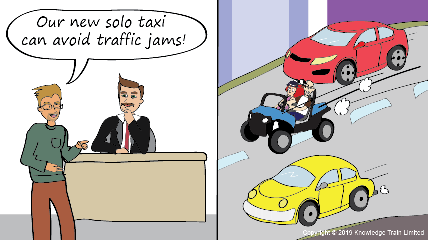

= Continual Service Improvement Skill Area

After the service has gone live in its operating environment, customers will gain more value if the service is continuously improved. Improvements might come from better strategy, design, transition and operation of services. The ITIL Continual Service Improvement stage provides best practice guidance on creating and maintaining value for customers. 

This focuses on achieving improvements in the quality of service, operational efficiencies and business continuity by ensuring that the service portfolio remains aligned to business strategy. Continuous improvement relies upon feedback from any stage of the service lifecycle to identify improvement opportunities for other stages of the lifecycle.

In IT service management too, improvements are absolutely essential. The services that were conceived in the service strategy phase, designed in the service design phase, built and deployed in the transition phase, and maintained in the service operations phase have to remain relevant. The only way they can remain useful and competitive is if they improve, improvement in terms of what it can deliver, how quickly it can be delivered, and with a reduced rate of breakdowns.

    Scroll down to read the entire Continual Service Improvement skill area.

[cols="20%,20%,20%,20%,20%",frame=all, grid=all]
|===
1.3+^.^h|*Key Behavior* 
4+^.^h|*Proficiency Level*

^.^h|*1*
^.^h|*2*
^.^h|*3*
^.^h|*4*

^.^h|*Imitative*
^.^h|*Operative*
^.^h|*Adaptive*
^.^h|*Developmental*

a|Continual Service Improvement 

*Description:*

Aligns and realigns IT Services to the changing business requirements by identifying and implementing changes for improvements. 
|Take responsibility for their own tasks and deliver on commitments following service level agreements (SLA)
|Analyzes service level achievement results to help teammates in ways to work efficiently (day to day)
|Identifies and implements individual activities to improve IT service quality and improve the efficiency and effectiveness of enabling ITSM processes
|Models a culture of efficiency within the team where people make good, timely decisions using available data and assessing multiple alternatives
|===

== Any question?

If you have a question or something to discuss about this topic, post your questions through https://alterra.tribe.so/login?redirect=/[Tribe].

== Reference
Vernon Lloyd (2011). ITIL Continual Service Improvement. 2011 ed. London: The Stationery Office; https://www.kornev-online.net/ITIL/OGC%20-%20ITIL%20v3%20-%20Continual%20Service%20Improvement.pdf[URL].