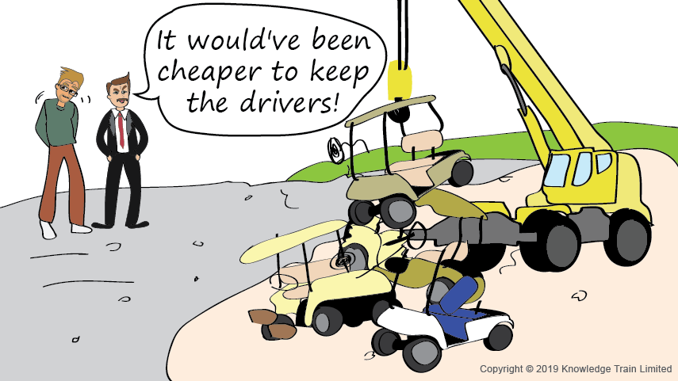

= Service Operation Skill Area

An organisation's strategic objectives are only realized by operating the service. This requires effective and efficient delivery and support of IT services to ensure the customer realises the value which was intended.

Service operations entails maintenance and making sure the services are running as per the plan—status quo is achieved. Service operations deals with maintaining services that have been implemented in the service transition phase. In this phase, no functional or nonfunctional modifications are performed to the service. A status quo is maintained, ensuring that the service runs as it was designed to.

The service operations phase runs the longest in terms of timeline, is the biggest in terms of staff strength, and, most importantly, the customer generally forms a perception of the service provider through the operational phase achievements.

    Scroll down to read the entire Service Operation skill area.

[cols="20%,20%,20%,20%,20%",frame=all, grid=all]
|===
1.3+^.^h|*Key Behavior* 
4+^.^h|*Proficiency Level*

^.^h|*1*
^.^h|*2*
^.^h|*3*
^.^h|*4*

^.^h|*Imitative*
^.^h|*Operative*
^.^h|*Adaptive*
^.^h|*Developmental*

a|Incident Management

*Description:*

The practice of restoring services as quickly as possible after an incident. 
|Follows a common process and procedure to meet service level agreements and records incidents cataloging them by symptom and resolution
|Identifies and analyzes the types of incidents related to ITSM daily activities to provide first line investigation and diagnosis
|Makes improvement through creation root cause of incidents from incident catalog recording
|Increases IT infrastructure & service reliability for the restoration by reducing the recurrence of incidents related to these errors

a|Request fulfillment and access management

*Description:*

- The process responsible for managing the life cycle of all service requests from the users.
- Effectively the execution of the policies in information security management.
|Helps resolve software and technical questions for the customers following agreed procedures
|Identifies and designs the organizational needs of user access types and delivers the components of requested standard services
|Provides access to authorized users and regularly audit ITSM tickets for improvement
|Establishes a channel for customers to request and receive standard services in an efficient and timely manner for which a predefined authorization and qualification process exists to deliver value for money
|===

== Any question?

If you have a question or something to discuss about this topic, post your questions through https://alterra.tribe.so/login?redirect=/[Tribe].

== References
David Nichols & Janet Kuhn (2013). Service Operation ITIL Lifecycle Certification. Lexington: itSM Solutions Publishing; http://www.itsmsolutions.com/wp-content/uploads/2013/03/ITIL-SO-Sample-Manual1.6r.pdf[URL].

Randy A. Steinberg (2011). ITIL Service Operation. 2011 ed. London: The Stationery Office; http://www.teraits.com/pitagoras/marcio/itil/OGC_ITIL_v3_5_Service_Operation.pdf[URL].

________ (2013). ITIL: Introducing Service Operations; Oxford: UCISA; https://www.dphu.org/uploads/attachements/books/books_5021_0.pdf[URL].