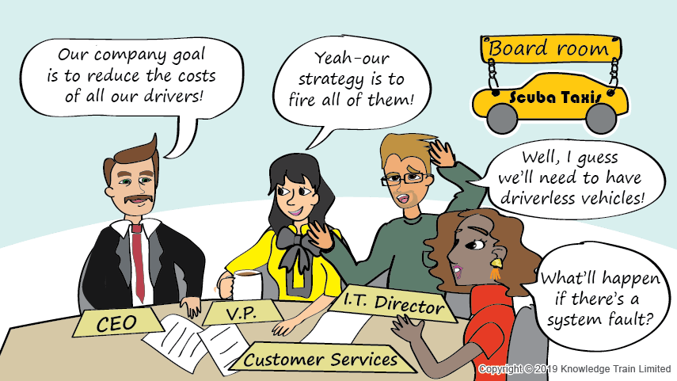

= Service Strategy Skill Area

Successful organisations tend to have clear objectives, and a clear overall business strategy explaining how the organisation intends to achieve those objectives. The overall business strategy tends to have individual strategies for the different business units within the organisation, one of which is an IT strategy. The IT strategy therefore supports and validates the business strategy.

An IT strategy covers multiple aspects, one of which is the IT service strategy. This explains how IT services will be used to enable IT to achieve its objectives, and how IT services support the overall business strategy.

The ITIL Service Strategy stage focuses on the concepts an IT service provider can use to build its IT service strategy. It describes how the IT service provider must set clear objectives and performance expectations for the IT service strategy to be successful in serving its targeted customers. The main intent is to create value for customers.

The value creation starts at the service strategy lifecycle phase. It defines the perspective, position, plans, and patterns that a service provider needs to be able to execute to meet Alterra outcomes.

    Scroll down to read the entire Service Strategy skill area.

[cols="20%,20%,20%,20%,20%",frame=all, grid=all]
|===
1.3+^.^h|*Key Behavior* 
4+^.^h|*Proficiency Level*

^.^h|*1*
^.^h|*2*
^.^h|*3*
^.^h|*4*

^.^h|*Imitative*
^.^h|*Operative*
^.^h|*Adaptive*
^.^h|*Developmental*

a|Strategy Management for IT Services

*Description:*

A process of defining and maintaining the perspective, position, plans, and patterns of an organization with regards to its services and management of those services. 
|Gathers information from a variety of sources to reach a conclusion and reports them
|Identifies the processes and techniques required to create a possibility improvement for service management
|Analyzes the activities required to obtain support from critical resources and remove barriers
|Develops strategies aligned to the organization’s objectives and stated outcomes, that are designed to take advantage of business opportunities

a|Business Management

*Description:*

Ensures the IT services are suitable and effective from the customer’s point of view.
|Replicates, troubleshoots, and describes simple issues accordance to available knowledge base and report to  product/engineering
|Systematically interprets user problems and identifies solutions and possible side effects
|Monitors customer complaints to analyze the impacts on existing service, make an improvement, and perform a risk analysis
|Delivers value for money through customer engagement and ensures that the service provider has sufficient capacity to meet demand
|===

== Any question?

If you have a question or something to discuss about this topic, post your questions through https://alterra.tribe.so/login?redirect=/[Tribe].

== References
David Cannon (2011). ITIL® Service Strategy. 2nd ed. London: The Stationery Office; https://www.kornev-online.net/ITIL/01%20-%20ITIL%20V3%202011%20Service%20Strategy%20SS.pdf[URL].
_______ (2011). ITIL Stage Service Strategy. Germany: Wiki; https://wiki.en.it-processmaps.com/index.php/Category:Service_Strategy[URL].