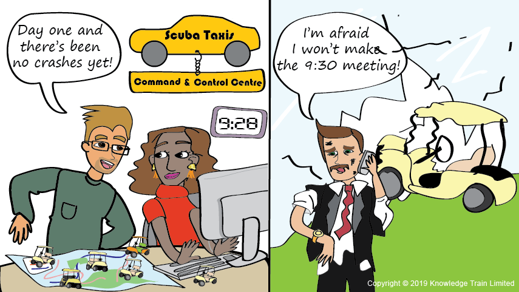

= Service Transition Skill Area

After the service has been designed, it must be transitioned into operational use. This is done by a new or changed service design package being tested to ensure it meets the business needs. This is then deployed into the live production environment.

The ITIL Service Transition stage introduces the concept of a service knowledge management system (SKMS), which supports organisational learning and helps to improve the efficiency and effectiveness of all the service lifecycle stages. It enables people to learn lessons, supports informed decision-making, and improves the management of services.

    Scroll down to read the entire Service Transition skill area.

[cols="20%,20%,20%,20%,20%",frame=all, grid=all]
|===
1.3+^.^h|*Key Behavior* 
4+^.^h|*Proficiency Level*

^.^h|*1*
^.^h|*2*
^.^h|*3*
^.^h|*4*

^.^h|*Imitative*
^.^h|*Operative*
^.^h|*Adaptive*
^.^h|*Developmental*

a|Change Management

*Description:*

A process designed to understand and minimize risks while making IT changes. 
|Follows service transition policies, processes, guidelines, and standards to handle all changes
|Identifies and analyzes the problem that require more change and contributes to make a plan for tools and service transition processes improvement
|Implements processes, technology, and management information system as envisioned by service strategy and as designed by service design to increase customer satisfaction
|Plans and obtain resources needed to transition service design plans and monitors the performance of transition activities

a|Service asset and configuration management, and validation

*Description:*

- A process to identify, document and administrate all the Configuration Items (CIs) required for delivering IT services, including their relationships and dependencies.

- A process used for actively maintaining test environments, and to ensure that the developed releases meet the customer’s expectations.
|Gathers the required information and listing service assets and configuration items
|Able to apply a structured validation and test process within agreed service levels by identifying and addressing issues throughout Service Transition
|Implements test measurements and improves the efficiency and effectiveness by providing accurate and up-to-date configuration and asset management data
|Plans and obtain resources needed to transition service design plans and monitors the performance of transition activities

a|Knowledge management

*Description:*

Ability to create a knowledge culture within the organization through a focus on sharing relevant knowledge
|Provides documentation in a form of FAQ for repetitive questions and records reliability data for IT Support services
|Able to apply conceptual (planning level) and physical (implementation level) and accessing valuable knowledge from outside sources
|Monitors service delivery channels to collect performance data, captures external knowledge, adapting it to improve service quality
|Accumulates knowledge through processes and workflow to ensure performance of service delivery through all channels is carried out, metrics and reports are structured
|===

== Any question?

If you have a question or something to discuss about this topic, post your questions through https://alterra.tribe.so/login?redirect=/[Tribe].

== Reference
Stuart Rance (2011). ITIL Service Transition. 2011 ed. London: The Stationery Office; https://tomjsmyth.files.wordpress.com/2015/04/itilv3st-itil-v3-service-transition.pdf[URL].