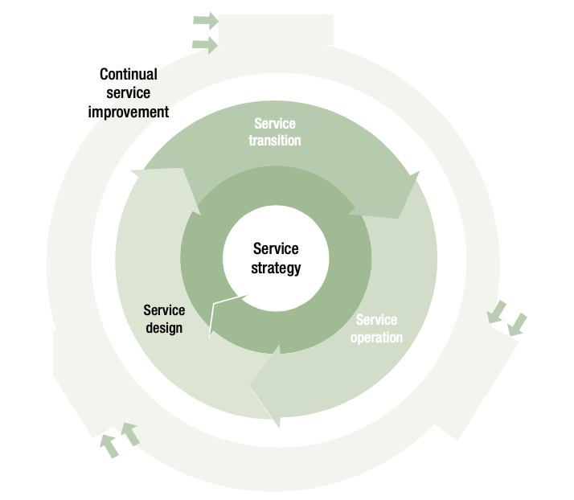

= Technical Support (ITS) Competency Matrix

== What is Technical Support (ITS) Technical Domain?

*Technical skills* and associated activities are the *primary focus* of *ITS Competency Matrix*, they are grouped as lifecycle skill areas. How about ITS lifecycle skill areas? It will be explained by the figure beside. 

What aren’t we talking about ITS instead of ITIL? ITS runs on frameworks such as ITIL (Information Technology Infrastructure Library), a de facto standard for IT Serrvice Management.

== What are skill sets for ITS Technical Domain?

ITIL v3 (ITIL henceforth) was derived from various high-level activities that encountered an IT service, and each of these high-level activities were introduced as phases in the ITIL service lifecycle. The five phases are listed in the list below.

*Reference: https://drive.google.com/file/d/1vytU4x_3326YKRCkGu-WCECz09EcNgmz/view[Become ITIL Foundation Certified in 7 Days] (Learning ITIL Made Simple)*

* link:./Service-Strategy-Skill-Area.adoc[Service Strategy Skill Area]
* link:./Service-Design-Skill-Area.adoc[Service Design Skill Area]
* link:./Service-Transition-Skill-Area.adoc[Service Transition Skill Area]
* link:./Service-Operation-Skill-Area.adoc[Service Operation Skill Area]
* link:./Continual-Service-Improvement-Skill-Area.adoc[Continual Service Improvement Skill Area]

== How far can you g(r)o(w)?

Find out your answer by learning about Alterra career track, link:../Technical-Support-Rating-Standard/index.adoc[Technical Support (ITS) Rating Standard].

== Any question?

If you have a question or something to discuss about this topic, post your questions through https://alterra.tribe.so/login?redirect=/[Tribe].

== References

* Abhinav Krishna (2017). Become ITIL Foundation Certified in 7 Days (Learning ITIL Made Simple); https://drive.google.com/file/d/1vytU4x_3326YKRCkGu-WCECz09EcNgmz/view[URL]. 
* Alterra Career Framework (2020); Jakarta: Alterra Group; https://drive.google.com/file/d/1XgQSGRJu48vn3PVT2eAXULYTGYelfmWF/view[URL].
* David Bentley (2016). IT Service Management Leadership White Paper. London: Cranford Group; http://brighthorse.co.uk/wp-content/uploads/2016/09/Cranford-Executive-ITSM-White-Paper-Web-version.pdf[URL].
* IEEE Computer Society (2014). Software Engineering Competency Model; http://dahlan.unimal.ac.id/files/ebooks/SWECOM.pdf[URL]
* Mettle (2019). The Complete Guide to Cognitive Skills at Work. _______; https://mettl.com/downloads/wp-content/uploads/sites/12/2019/04/Mercer-Mettl_Cognitive-Guide_Horizontal_ISO[URL]
* SDI (2016). Professional Standard Service Desk Manager. Orpington: Service Desk Institute; https://www.servicedeskinstitute.com/wp-content/uploads/2016/12/SDM_Prof_Standards.pdf[URL].
* Simon Buehring (2020). What is ITIL? London: Knowledge Train; https://www.knowledgetrain.co.uk/it/itil/what-is-itil[URL].