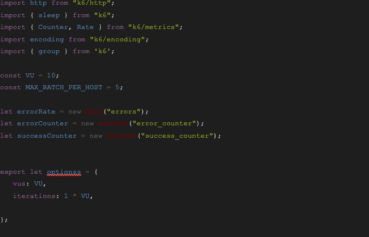
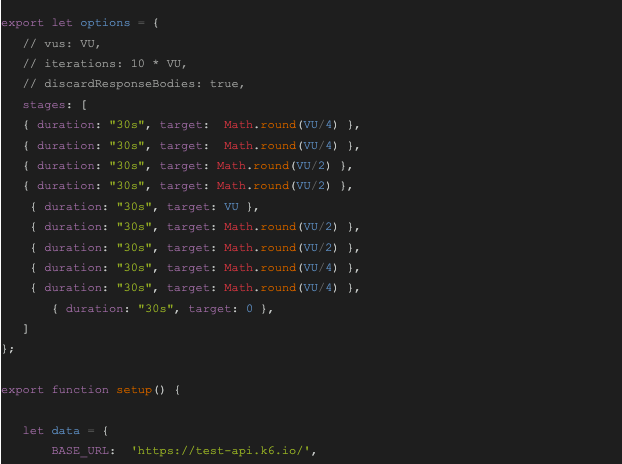
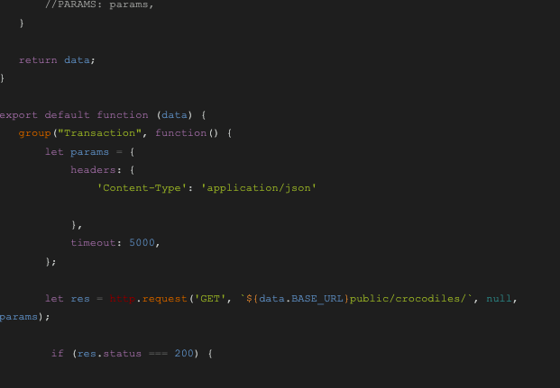
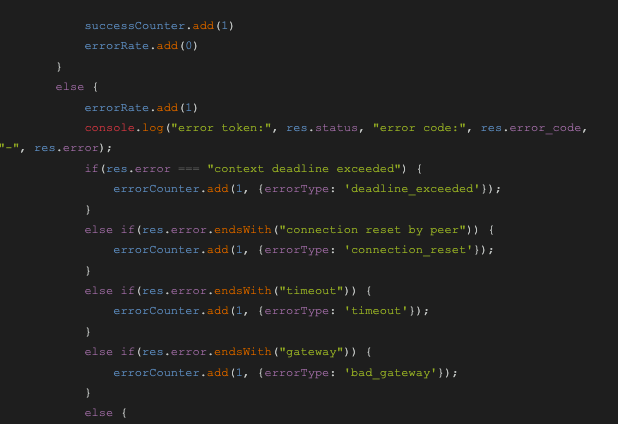
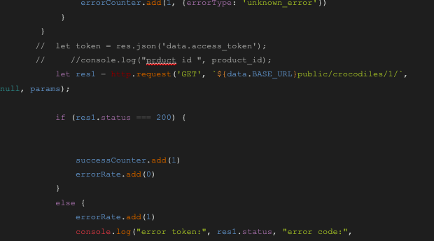
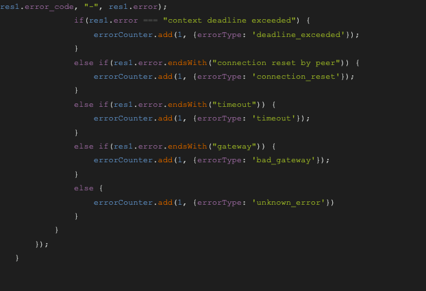
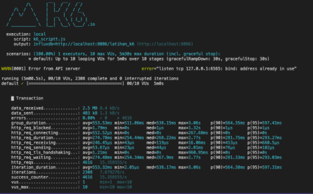

= Create Script K6

Untuk membuat _script_ K6, kamu bisa men-_convert_-nya dari Postman Collection, kemudian mengikuti langkah-langkah di bawah ini.

[cols="5%,25%,35%,35%",frame=all, grid=all]
|===
^.^h|*No* 
^.^h|*Step* 
^.^h|*Command*
^.^h|*Note*

|1
|Clone repository
a| ----
`$ git clone https://github.com/k6io/example-postman-collection.git`
----
|

|2
|Install Node.js and npm from Nodesource
a|----
$ curl -sL https://deb.nodesource.com/setup_12.x

sudo -E bash -

$ sudo apt install nodejs
----
|Versi 12 digunakan karena LTS Version yang lebih stabil dan bisa untuk jangka waktu yang lebih lama

|3
|Cek Node dan NPM version 
a|----
$ node --version

$ npm --version
----
|

|4
|Install postman-to-k6
a|----
$ npm install -g postman-to-k6
----
|Meng-install postman-to-k6 kita bisa mengubah postman collection ke K6

|5
|Convert postman collection to K6 _script_
|----
$ postman-to-k6 test-api.json -e env.json -o k6-_script_.js
----
a|* Postman-to-k6 adalah aplikasi yang digunakan
* Test-api.json adalah nama file postman collection
* -e untuk menginfokan bahwa postman collection memiliki environment dengan nama env.json
* -o adalah untuk output berupa k6 _script_ yang diberi nama k6-_script_.js

|6
|Install K6
a|----
$ sudo apt-key adv --keyserver hkp://keyserver.ubuntu.com:80 --recv-keys 379CE192D401AB61

$ echo "deb https://dl.bintray.com/loadimpact/deb stable main" sudo tee -a /etc/apt/sources.list

$ sudo apt-get update

$ sudo apt-get install k6
----
|

|7
3.1+a| Cek _script_ yang sudah di-_convert_. Fungsi dari _convert_ ini untuk memudahkan edit beberapa bagian daripada mengubahnya secara keseluruhan. Pada _script_ yang sudah di-_convert_, diasumsikan hanya 2 _endpoint_, yaitu:

https://test-api.k6.io/public/crocodiles/[]

https://test-api.k6.io/public/crocodiles/1[]

yang akan diuji dan menggunakan metode load testing. Kamu bisa membaca metode test lainnya link:https://k6.io/docs/test-types/introduction/[di sini]. Berikut _script_ yang dibuat untuk materi ini.

|8
|Untuk menjalankan _script_ tersebut
a|----
k6 run /yourfolder/k6-_script_.js
----
|

|9
3.1+a|Berikut hasilnya

|===