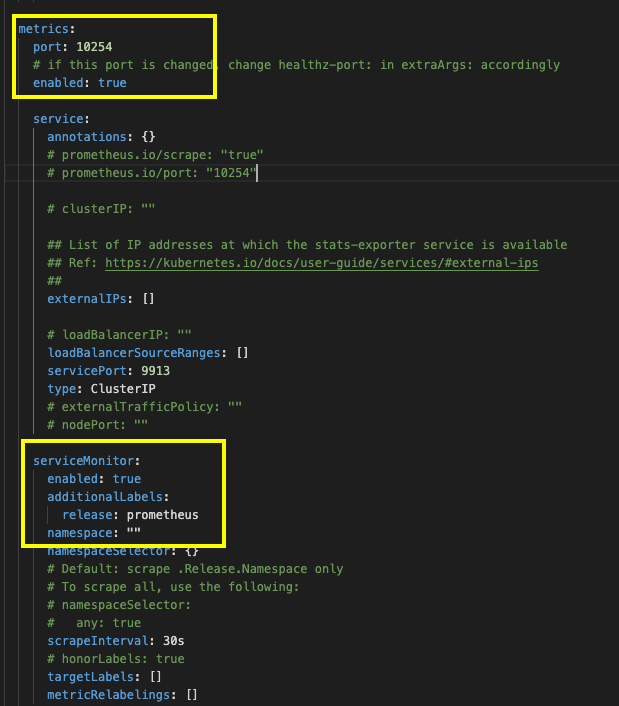

= Prometheus & Grafana

== What is Prometheus?

Prometheus *is an open-source systems monitoring and alerting tool kit*. It collects metrics from *configured targets at given intervals*, evaluates *rule expressions, displays the results,* and *can trigger alerts if some condition is observed to be true*. 

But in another definition, I would like to think about prometheus *as a time series database with a powerful query language*.

== Why Prometheus?

Everything *has become compartmentalized*. Monolithic mainframes have vanished, replaced by *serverless servers, micro serverices, and containers*. With these kind of architecture, we need APM tools to monitor all of our applications, one of the powerfull APM tools is Prometheus. But why? here is my reason :

=== Using Time Series Database

As i said before, promethues is time series database (TSDB). When we have many micro services, many containers, finding the sequence of things happening in real time over many many systems running in parallel requires a monitoring system build on top of solid TSDB foundation.

=== Push vs Pull Model for Metrics Collection

*a metric is essentially a measurement of a property of a portion of an application or system*. Metrics make an observation by keeping track of the state of an object. These *observations* are some value or a series of related values *combined with a timestamp that describes the observations*, the output of which is commonly called time-series data.

In Push-based monitoring the application being monitoring becomes an emitter of data “pushing” metrics and events on some time interval or a constraint violation. *This approach typically favors a decentralized structure* and has the advantage of not requiring the monitoring system to “pre-register” the monitored component as the emitter pushes data to the configured destination upon start. But it suffers from several drawbacks and *loses its clear visibility* if a *push based agent dies* or *doesn’t respond over time*. Also, the *amount of data pushed needs be optimized* in this approach(because it is a part of the application and application throughput in some sense.)

Pull/polling based solutions works differently in that they pull data which are exposed via different services and endpoints. are quite common in monitoring and historically *favors a centralized organizational structure*, although this is not a requirement. Primarily, in pull-based monitoring, the *monitoring system asks or queries a monitored component*, for example, *pinging a host* or to see *if a website is up*.

*Prometheus is a pull based system which pulls data from configured sources at regular intervals.*

=== Architecture

Most Prometheus components are written using go, making them easy to build and deploy as static binaries for all types of target/systems. Prometheus scrapes metrics from instrumented jobs, either directly or via an intermediary push gateway for short-lived jobs. It stores all scraped samples locally and runs rules over this data to either aggregate and record new time series from existing data or generate alerts

Prometheus’s main features are:

1. A multi-dimensional link:https://prometheus.io/docs/concepts/data_model/[data model] with time series data identified by metric name and key/value pairs

2. *PromQL*, a link:https://prometheus.io/docs/prometheus/latest/querying/basics/[flexible query language] to leverage this dimensionality

3. Time series collection happens via a *pull model over HTTP*

4. link:https://prometheus.io/docs/instrumenting/pushing/[Pushing time series] is supported via an intermediary gateway

5. Targets are discovered via *service discovery or static configuration*

6. multiple modes of *graphing and dashboarding support*

The Prometheus ecosystem consists of multiple components, many of which are optional:

1. The main link:https://github.com/prometheus/prometheus[Prometheus server] which scrapes and stores time series data

2. link:https://prometheus.io/docs/instrumenting/clientlibs/[Client libraries] for instrumenting application code

3. A link:https://github.com/prometheus/pushgateway[push gateway] for supporting short-lived jobs

4. Special-purpose link:https://prometheus.io/docs/instrumenting/exporters/[exporters] for services like HAProxy, StatsD, Graphite, etc. which sends metrics from an existing system or software.

5. An link:https://github.com/prometheus/alertmanager[alertmanager] to handle alerts

=== Flexibility

As we know, Prometheus is an opensource project. We flexible to modify, configure and combine with another third party software according to company needs.

== Prometheus Step by Step Installation

In this article, i want to to demonstrate about prometheus installation using Helm.

1. First, we need to install helm according tou our operating system. what is helm? helm is package manager insallation

2. Add chart repository using command :
+
----
`helm repo add prometheus-community https://prometheus-community.github.io/helm-charts`
----
+
(we use prometheus community because all of chart now under prometheus community, stable version was deprecated)

3. Update the repository and validate repository :
+
----
helm repo update
helm search repo prometheus-community
----

4. Install prometheus bundle (grafana, node exporter, etc) using :
+
----
helm install prometheus prometheus-community/kube-prometheus-stack
----

5. Check prometheus installation using:
+
----
kubectl get pods -l "release=prometheus"
kubectl get service
kubectl get servicemonitor
----

6. Expose prometheus and grafana
+
----
kubectl port-forward service/prometheus-service-name 9090
kubectl port-forward service/grafana-service-name 3000
----

7. Access it on browser using credentials : username -> admin password -> prom-operator

== Prometheus Monitoring Type

In my experience, there is 3 kinds of monitoring using prometheus 

1. Simple App Monitoring (monitor pod only)

2. Third party Monitoring

3. Instrument App Monitoring (using prometheus client library based on language)

=== Simple App Monitoring 

Just deploy our application as usual, and all resource of our application pods will expose metrics automatically, we can monitor it on grafana using pod filter.

Example (install simple golang app):

1. deployment.yaml
+
----
#backend-deployment.yaml
apiVersion: apps/v1
kind: Deployment
metadata:
  name: backend-dpl
spec:
  replicas: 1
  selector:
    matchLabels:
      app: backend
  template:
    metadata:
      labels:
        app: backend
    spec:
      containers:
          name: backend-container
          image: lmnzr/simplebackend:latest
          resources:
            limits:
              memory: "128Mi"
              cpu: "500m"
          ports:
              name: go-backend
              containerPort: 8080
----

2. Service.yaml
+
----
#backend-service.yaml
apiVersion: v1
kind: Service
metadata:
  name: backend-svc
  labels:
    app: backend
    release: prometheus
spec:
  ports:
    name: go-backend
    port: 8080
    targetPort: 8080
    protocol: TCP
  selector:
    app: backend
----

3. Run all file using :
+
----
kubectl apply -f deployment.yaml
kubectl apply -f service.yaml
----

4. Expose prometheus and grafana service, here is the screenshoot:
+

=== Monitoring Third Party Installation

On this section, we will try to install third party software like mongodb, nginx, ingress, etc. By default, prometheus has exporter for third party apps like mongodb exporter, nginx-ingress exporter, mysql exporter, etc. If we use helm package manager, we just add it into local repo and overwrite values.yml.

=== Nginx Ingress example

1. First, we create our values.yaml. Refer from :
+
https://github.com/kubernetes/ingress-nginx/tree/master/charts/ingress-nginx , if we want to monitor or expose nginx-ingress, we must enable metrics and service monitor
+ 

+
So, we copy all value.yaml (https://github.com/kubernetes/ingress-nginx/blob/master/charts/ingress-nginx/values.yaml ) and enable metrics and servicemonitor. Don't forget to add label “release: prometheus”

2. Then, run installation process :
+
----
helm repo add ingress-nginx https://kubernetes.github.io/ingress-nginx
 
helm repo update
 
helm install ingress ingress-nginx/ingress-nginx -f values.yaml
----

3. Then, wait until all process done, check all pods, service and servicemonitor, then expose prometheus service and check prometheus target. All metrics will automatically added.
+

+

=== Mongodb example

1. First, we create sample app using mongodb 
+
Mongodb.yaml
+
----
apiVersion: apps/v1
kind: Deployment
metadata:
  name: mongodb-deployment
  labels:
    app: mongodb
spec:
  replicas: 1
  selector:
    matchLabels:
      app: mongodb
  template:
    metadata:
      labels:
        app: mongodb
    spec:
      containers:
        name: mongodb
        image: mongo
        ports:
      containerPort: 27017
---
apiVersion: v1
kind: Service
metadata:
  name: mongodb-service
spec:
  selector:
    app: mongodb
  ports:
      protocol: TCP
      port: 27017
      targetPort: 27017 
----

2. Then, run the file using :
+
----
kubectl apply -f Mongodb.yaml
----

3. Create values.yaml
+
mongodb:
+
----
  uri: "mongodb://mongodb-service:27017"
serviceMonitor:
  additionalLabels:
    release: prometheus
----

4. Then, run installation process :
+
----
helm install mongodb prometheus-community/prometheus-mongodb-exporter -f values.yaml
----

5. Then, wait until all process done, check all pods, service and servicemonitor, then expose prometheus service and check prometheus target. All metrics will automatically added.
+

=== Instrument Specific Application

On this section, we try to monitor and instrument a simple application (RPC app) using prometheus (client app libraries), more info : link:https://prometheus.io/docs/instrumenting/clientlibs/[Instrumenting app on prometheus]

1. rpc-app-deployment.yaml:
+
----
apiVersion: apps/v1
kind: Deployment
metadata:
  name: rpc-app-deployment
spec:
  selector:
    matchLabels:
      app: rpc-app
  replicas: 2
  template:
    metadata:
      labels:
        app: rpc-app
    spec:
      containers:
        name: rpc-app-cont
        image: supergiantkir/prometheus-test-app
        ports:
          name: web
          containerPort: 8081
----

2.  Then, create file rpc-app-service-and-servicemonitor.yaml
+
----
apiVersion: v1
kind: Service
metadata:
  name: rpc-app-service
  labels:
    app: rpc-app
    release: prometheus
spec:
  ports:
    name: web
    port: 8081
    targetPort: 8081
    protocol: TCP
  selector:
    app: rpc-app
 
---
apiVersion: monitoring.coreos.com/v1
kind: ServiceMonitor
metadata:
  name: rpc-app
  labels:
    env: production
    release: prometheus
spec:
  selector:
    matchLabels:
      app: rpc-app
  endpoints:
    port: web
----

3. Run all file using
+
----
kubectl apply -f rpc-app-deployment.yaml
kubectl apply -f rpc-app-service-and-servicemonitor.yaml
----

4. Wait until all pods, service are running, then expose prometheus service.
+

Note :

* If we want to make a monitoring on prometheus, make sure we have a three components : deployment(application pods), service, and servicemonitor (most imoportant)

* Make sure, servicemonitor have additional labels “*release: prometheus*”

* By default, service monitor will scrape path /metrics

* Make sure you have implement client libraries on your application and expose it to /metrics url. link:https://prometheus.io/docs/instrumenting/clientlibs/[More info : Prometheus Instrumenting Application]

Default Prometheus Grafana Dashboard 

Reference : 

* https://dev.to/ko_kamlesh/install-prometheus-grafana-with-helm-3-on-local-machine-vm-1kgj[]

* https://stackoverflow.com/questions/55417410/kubernetes-create-deployment-unexpected-schemaerror[] 

* https://devops4solutions.com/monitor-kubernetes-cluster-using-prometheus-and-grafana[]

* https://blog.gojekengineering.com/diy-how-to-set-up-prometheus-and-ingress-on-kubernetes-d395248e2ba[] 

* https://medium.com/kubernetes-tutorials/simple-management-of-prometheus-monitoring-pipeline-with-the-prometheus-operator-b445da0e0d1a[] 

* https://levelup.gitconnected.com/deploying-simple-golang-webapp-to-kubernetes-25dc1736dcc4[] 

* https://prometheus-community.github.io/helm-charts/[] 

* https://youtu.be/X48VuDVv0do[] 

* https://youtu.be/mLPg49b33sA[] 

* https://youtu.be/fAmYRWJnPzM[] 

* https://medium.com/@arindampaul/introducing-prometheus-with-grafana-metrics-collection-and-monitoring-36ca88ac4332[]

* https://github.com/kubernetes/ingress-nginx/tree/master/charts/ingress-nginx[] 