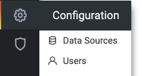
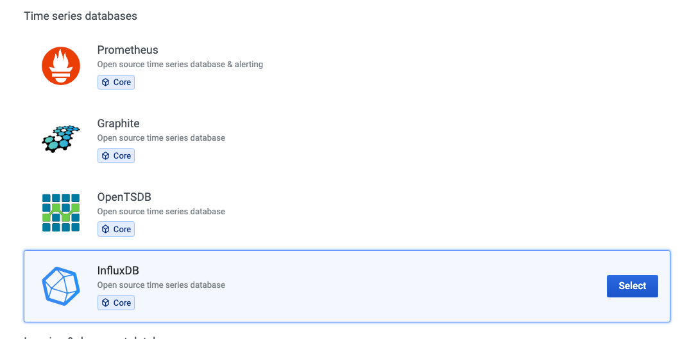
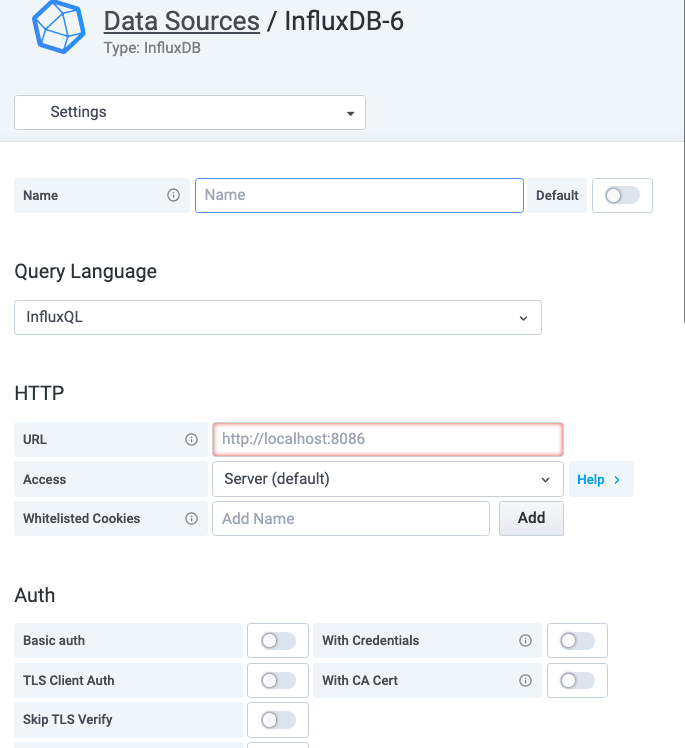
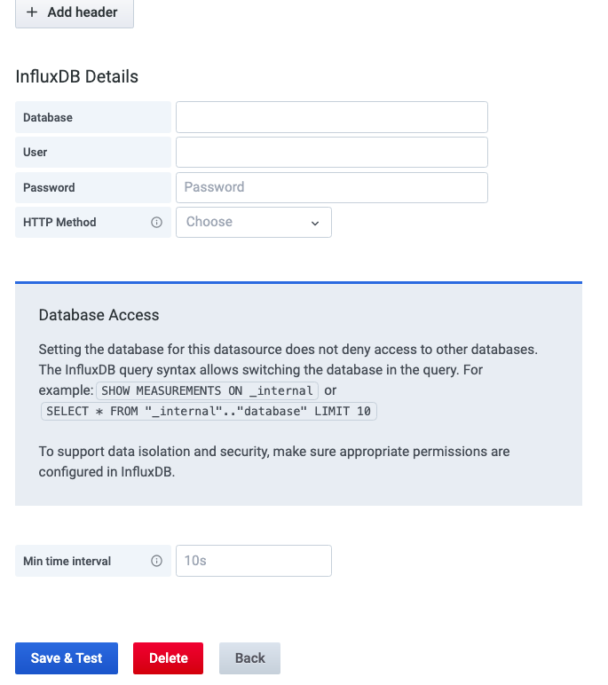
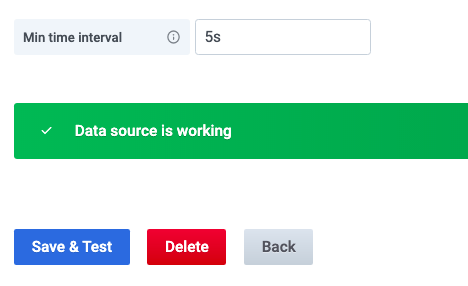
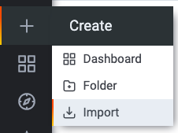
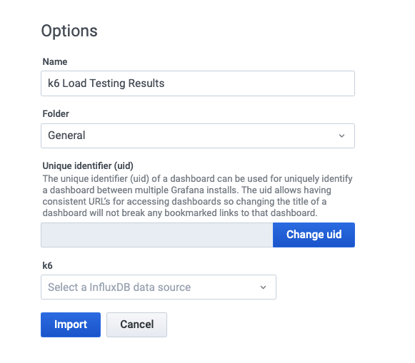
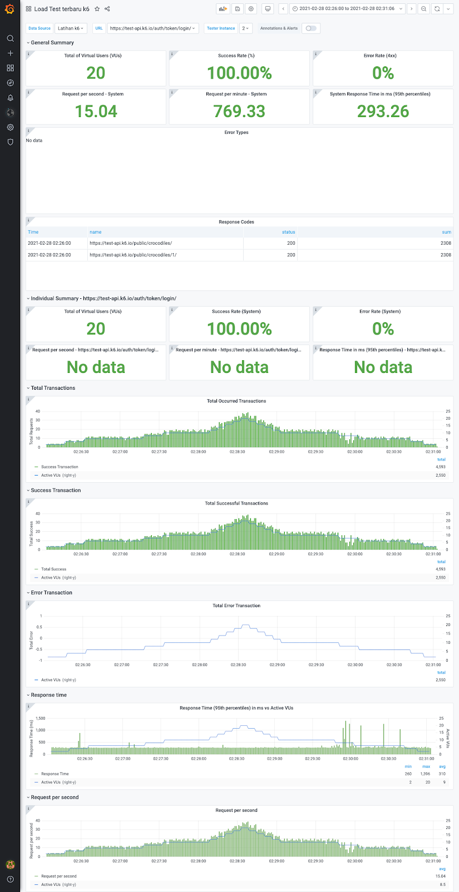

= Visualisasi Data Hasil Performance Test

Sebelum melakukan pengetesan, kita juga bisa menambahkan suatu _command_ untuk mengirim hasil _performance test_ dari _script_ K6 ke Influxdb. Nantinya data tersebut akan divisualisasikan ke dalam Grafana. Ikuti langkah-langkah di bawah ini agar lebih mudah memahami dan mempraktikannya.

1. Pakai link:./Architecture-Learning-Materials/Create-Script-K6.adoc[script K6] yang sudah dibuat sebelumnya
+
2. Buat _database_ di K6 menggunakan influxdb. Sebelum membuat _database_, mari instal terlebih dahulu (Ubuntu 20.04)
+
[cols="40%,60%",frame=all, grid=all]
|===
|Add repo to Ubuntu 20.04 
a|----
wget -qO- https://repos.influxdata.com/influxdb.key

sudo apt-key add - source /etc/os-release
echo "deb https://repos.influxdata.com/debian $(lsb_release -cs) stable" 

sudo tee /etc/apt/sources.list.d/influxdb.list
----

|Install dan start InfluxDB service
a|----
sudo apt-get update && sudo apt-get install influxdb

sudo service influxdb start
----

|Config influxDB
a|----
influxd -config /etc/influxdb/influxdb.conf
----

a|Set the environment variable 

`INFLUXDB_CONFIG_PATH` to the path of your configuration file and start the process.

a|For example:

----
echo $INFLUXDB_CONFIG_PATH

/etc/influxdb/influxdb.conf

influxd
----

|Periksa data dan WAL directory permissions
|Informasi lebih lanjut dapat diakses link:https://docs.influxdata.com/influxdb/v1.8/administration/config/#data-settings[di sini]

|Create DB
a| influxd

Create database (nama database)

Show databases untuk mengecek database yang sudah dibuat sudah ada dalam list atau belum
|===
+

3. Install Grafana untuk memvisualisasikan data hasil _performance test_ (Ubuntu 20.04)
+
[cols="40%,60%",frame=all, grid=all]
|===
| Install Grafana versi terbaru 
a|----
sudo apt-get install -y apt-transport-https

sudo apt-get install -y software-properties-common wget

wget -q -O - https://packages.grafana.com/gpg.key 

sudo apt-key add -
----

|Add repo
a|----
echo "deb https://packages.grafana.com/oss/deb stable main" 

sudo tee -a /etc/apt/sources.list.d/grafana.list
----

| Setelah add repo
a| ----
sudo apt-get update

sudo apt-get install grafana
----

| Start the server
a| ----
sudo systemctl start grafana-server

sudo systemctl status grafana-server
----
|===

4. Create data source
+
[cols="50%,50%",frame=all, grid=all]
|===
| Klik roda gigi ke menu samping, lalu klik *Data Sources* 
| 

|Klik *Add Data Source* di samping kanan halaman
| 

|Pilih *Influxdb* pada baris _database_ *Time Series*
|

a|Kamu akan masuk ke halaman pengaturan untuk menambahkan _data source_ baru.

- Isi Name box bisa sesuai nama _database_-mu

- Isi URL untuk mengetahui _store port_ hasil _performance test_

- Isi _database box_ dengan nama _database_ yang sudah kita buat, lalu klik *Save & Test*

- Time Interval bisa diisi dengan 5s. Jika _data source_ berhasil ditambahkan akan muncul seperti gambar di samping. 

a|

|===

5. Add dasboard untuk menampilkan data
+
[cols="40%,60%",frame=all, grid=all]
|===
| Download terlebih dahulu dashboard link:https://drive.google.com/file/d/1AQKjinMRonCRQIf00BwtglOK-7oIIq3q/view?usp=sharing[di sini] |
|Import dashboard
| 

| Upload JSON file. Tampilannya bisa dilihat seperti gambar di samping
| 

|Setelah klik import, akan diarahkan ke halaman dashboard yang sudah di-import tadi 
|
|===

6. Run script K6
+
----
K6 run --out “influxdb=http://localhost:8086/nama_database" /app/dummy_test.js"]
----

7. Tampilan dashboard
+

8. Seperti yang sudah disebutkan di materi sebelumnya, _throughput_ bisa dilihat pada _request per second_ dan _request per minute_. _Response time_ yang dipakai 95% _percentile_ (95% mewakili nilai keseluruhan _response time_ suatu sistem)

9. Ada juga beberapa cara untuk mendapatkan hasil _performance test_, bisa cek link:https://docs.influxdata.com/influxdb/v1.8/administration/config/#data-settings[di sini].